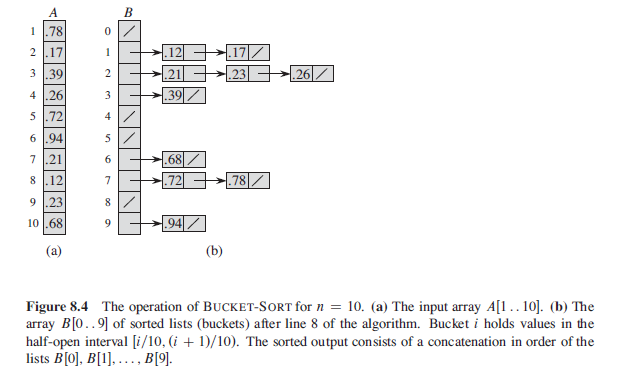

## Bucket Sort

Assumes that the input is drawn from a uniform distribution and has an average-case running time of O(n) i.e. assumes that the input is generated by a random process that distributes elements uniformly and independently over the interval [0, 1]. Bucket sort is fast like counting sort as they both assume something about the input.

Bucket sort divides the interval [0, 1] into n equal-sized subintervals/buckets, and then distributes the n input numbers into the buckets. To produce the output, we sort the numbers in each bucket and then go through the buckets in order:

- Assumes that each element A[i] satisfies 0<=A[i]<1.
- Requires an auxiliary array B[0..n-1] of linked lists (buckets).

### Algorithm (Pseudo)

```
bucketSort(A) {
    B = [0..n-1]
    n = A.length
    for (i=0; i<n-1; i++)
        B[i] = 0

    for (i=1; i<n; i++)
        // insert a linked list into B[n*A[i]]
        B[[n*A[i]]] = A[i]

    for (i=0; i<n-1; i++)
        sort B[i] with insertion sort

    concatenate lists B[0], B[1], ..., B[n-1] together in order
}
```

### Sequence of Events


