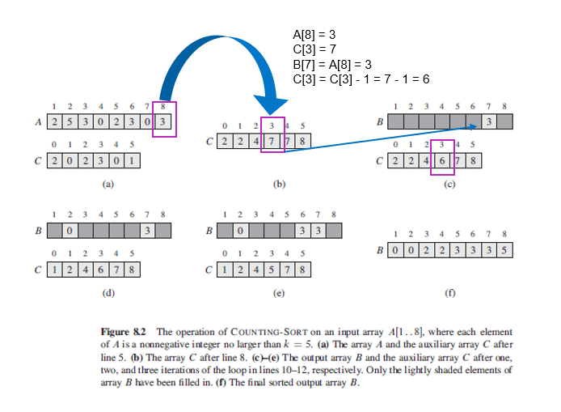

## Counting Sort

Sorting algorithm that sorts the elements by counting the number of occurrences of each unique element in the array. The count is stored in an auxiliary array and the sorting is done by mapping the count as an index of the auxiliary array. Has time complexity of O(k+n), where k is the largest number of the array. Features of counting sort:

- Assumes that each of n input elements is an integer in the range from 0 to k.
- For each input element x, determines the number of elements less than x.
- Uses this information to place element x directly into its position in the output array.
- Modification to scheme required for elements with same value as they should not be placed in the same position.
- Requires array B [1..n] which holds the sorted output, and array C[0...k] which provides temporary working storage.

### Algorithm (Pseudo)

```
// k is the maximum number in array A
countingSort(A,B,k) {
  C = []
  for (i=0; i < k; i++) {
    // initialize empty array of C with k number of variables
    C[i] = 0
  }

  for (j=1; j < A.length; j++) {
    // array C contains the number of elements equal to i
    // i.e. A[1] = 2 => increment number of elements containing 2 at C[2]
    // i.e. A[2] = 5 => increment number of elements containing 5 at C[5]
    C[A[j]] = C[A[j]] + 1
  }

  for (i=1; i < k; i++) {
    C[i] = C[i] + C[i-1]
  }
  // array C[i] now contains the number of elements less than or equal to i

  for (j=a.length; j > 1; j--) {
    B[C[A[j]]] = A[j]   // inserts element into correct position in B
    C[A[j]] = C[A[j]] - 1   // decrements number of elements <= C[i]
  }
}
```

### Sequence of Events


