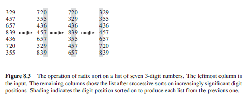

## Two-Phase Radix Sorting

Can be used to sort records of information that are keyed by multiple fields i.e. day, month, year. Procedure assumes that each element in the array has d digits, where digit 1 is the lowest-order digit and digit d is the highest-order digit. Complexity class is O(n).

For each phase, create an ordered set of queues corresponding to possible values, and concatenate them together. Repeat this process for each sorting criterion. Crucial detail is that queueing phases must be performed in the order of significance of each criteria, with least significant criteria first i.e. if data are two-digit integers, sort by last digit first, followed by first digit. Makes use of the fact that for each phase the items are from a strictly restricted set i.e. the items are of a particular form which is known as a priori.

### Algorithm (Pseudo)

```
radixSort(A, d) {
  for (i=1; i <d; i++)
    use counting sort as subroutine (or any stable sort) to sort array A on digit i
}
```

### Sequence of Events



### Sorting Dates

Sorting by days first followed by months.

[25/12, 28/08, 29/05, 01/05, 24/04, 03/01, 04/01, 25/04, 26/12, 26/04, 05/01, 20/04]

1. Create and fill queues for days without sorting them further.

```
01: [01/05]
03: [03/01]
04: [04/01]
05: [05/01]
20: [20/04]
24: [24/04]
25: [25/12, 25/04]
26: [26/12, 26/04]
28: [28/08]
29: [29/05]
```

2. Concatenate all queues.
3. Create and fill queues for months that are present.

```
01: [03/01, 04/01, 05/01]
04: [20/04, 24/04, 25/04, 26/04]
05: [01/05, 29/05]
08: [28/08]
12: [25/12, 26/12]
```

4. Concatenate all queues which returns items in sorted order.

```
[03/01, 04/01, 05/01, 20/04, 24/04, 25/04, 26/04, 01/05, 29/05, 28/08, 25/12, 26/12]
```
