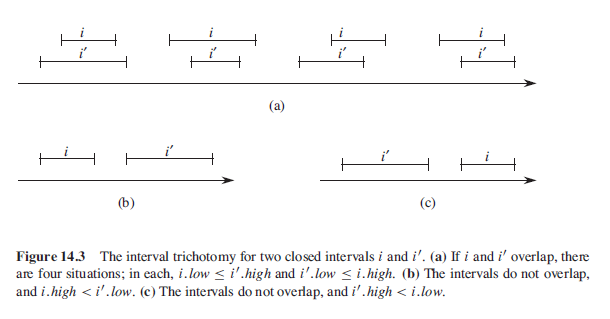
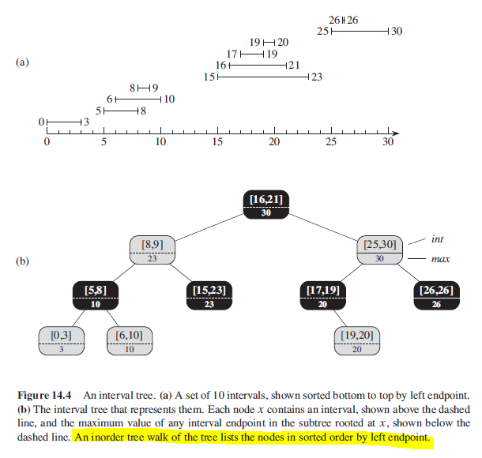

## Intervals

Intervals are convenient for representing events that each occupy a continuous period of time. Three types of intervals:

- Closed: an ordered pair of real numbers [t1,t2] where t1 <= t2.
- Open: omits both endpoints from the set.
- Half-Open: Omits one of the endpoints from the set.

Can represent an interval [t1,t2] as an object i with "low" and "high" attributes. Given two sets of intervals, they overlap if i.low <= i'.high and i'.low <= i.high. Any two intervals satisfy the **interval trichotomy** if exactly one of the properties holds:
a) i and i' overlap.
b) i is to the left of i' i.e. i.high < i'.low.
c) i is to the right of i' i.e. i'high < i.low.

### Figure



## Interval Trees

An interval tree is a red-black tree that maintains a dynamic set of elements, with each element x containing an interval x.int. Interval trees support the following operations:

```
x.max = max(x.int.high, x.left.max, x.right.max)

intervalInsert(T,x)     x contains an interval to the interval tree T
intervalDelete(T,x)
intervalSearch(T,i)
```

For interval search, given interval i = [22,25]:

- Begin with x as root with interval [16,21].
- x.left.max = 23 which is greater than i.low = 22.
- Loop continues with x = x.left.
- Node contains [8,9] and x.left.max = 21 which is lower than i.low.
- Loop continues with x.right with interval [15,23] which overlaps.

```
// Returns a pointer to x in the interval tree T if x.int overlaps i
// or a pointer to sentinel T.nil if no such element is in the set

intervalSearch(T,i) {
    x = T.root
    while x != T.nil and i does not overlap x.int
        if x.left != T.nil && x.left.max >= i.low
            x = x.left
        else
            x = x.right
    return x
}
```

### Figure


