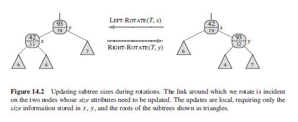

## Dynamic Order Statistics

The ith order statistic is simply the element in the set with the ith smallest key. An order statistic tree is simply a red-black tree with additional information stored in each node. The tree can be augmented by adding "size" property to each node which contains the number of internal nodes in the subtree rooted at x (including x itself). Keys are not required to be distinct.

```
x.size = x.left.size + x.right.size + 1
```

### Figure


## Retrieving an Element with Given Rank

From above figure, key 14 is stored in black and red nodes has rank 5 and 6 respectively. For 17th smallest element, key is 38. Has time complexity of O(lgn).

```
// returns a pointer to the node containing the ith smallest key
// in the subtree rooted at x

osSelect(x,i){
    // r refers to the rank ofnode x
    r = x.left.size + 1
    if i == r
        return x
    elseif i < r
        return osSelect(x.left,i)
    else
        return osSelect(x.right, i-r)
}
```

## Determining Rank of an Element

```
osRank(T,x) {
    rank = x.left.size + 1
    cur = x
    while cur !== T.root
        if cur == cur.parent.right
            rank = rank + cur.parent.left.size + 1
        cur = cur.parent
}
```

## Maintaining Subtree Sizes

### Default Insertion/Deletion

Simply increment x.size for each node x on the simple path traversed from the root down toward the leaves. For deletion, decrement the size by one.

### Rotations

Only structural changes are caused by rotations, of which there are at most two.

```
// for left rotation
leftRotate(T,x) {
    ...
    y.size = x.size
    x.size = x.left.size + x.right.size + 1
}
```

### Figure


