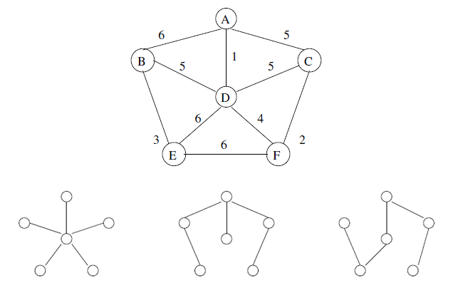

## Minimal Spanning Trees (MST)

For a connected and undirected graph G, a spanning tree is a subgraph that is an acyclic tree which connects all the vertices together, so it 'spans' the original graph but using fewer edges. Minimal refers to the sum of all the weights of the edges contained in that tree, so a minimal spanning tree has total weight less than or equal to the total weight of every other spanning tree (V-1 edges). There may not be a unique MST for a given graph.

Two greedy algorithms for solving MST are Kruskal's and Prim's algorithms. Can easily make use of them run in time O(E lgV) using ordinary binary heaps. By using fibonacci heaps, prim's algorithm runs in O(E + VlgV), which is faster if V << E.

### Algorithm

```
// w is weight function

genericMST(G,w) {
    // A is a set of edges
    A = {}
    while A does not form a spanning tree
        find an edge (u,v) that is safe for A
        A = A U {(u,v)}
    return A
}
```

### Figure



## Greedy Algorithms

An algorithm is greedy if it makes its decisions based only on what is best from the point of view of 'local considerations' i.e. what is best for that next step, with no concern about how the decision might affect the quality of the final overall solution. General idea is to start with an approximation like in Dijkstra's algorithm, and then refine it in a series of steps.
