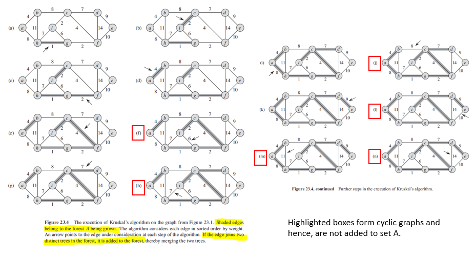

## Kruskal Algorithm (Greedy)

Kruskal's algorithm finds a safe edge to add to the growing forest by finding, of all the edges that connect any two trees in the forest, an edge (u,v) of least weight. Qualifies as greedy since at each step, it adds to the forest an edge of least possible weight.

A greedy edge-based approach. Does not consider the vertices directly at all, but builds a MST by considering and adding edges as follows:

1. Sort all edges in increasing order of their weight.
2. Pick the smallest edge. Check if it forms a cycle with the spanning tree.
3. If cycle is not formed, include this edge; else discard it.
4. Repeat until there are V-1 edges in spanning tree.

### Algorithm

```
mstKruskal(G,w) {
    A = {}
    for each vertex V E G.V
        // create |V| trees, one containing each vertex
        makeSet(v)
    sort the edges of G.E in increasing order by weight
    for each edge (u,v) element of G.E, taken in increasing order
        if findSet(u) != findSet(v)
            A = A U {(u,v)}
            union(u,v)
    return A
}
```

### Figure



### Example


```
Weight   Src    Dest
1         7      6
2         8      2
2         6      5
4         0      1
4         2      5
6         8      6
7         2      3
7         7      8
8         0      7
8         1      2
9         3      4
10        5      4
11        1      7
14        3      5
```

Steps as follows:

1. Pick edge 7-6: no cycle is formed, include it.
2. Pick edge 8-2: No cycle is formed, include it.
3. Pick edge 6-5: No cycle is formed, include it.
4. Pick edge 0-1: No cycle is formed, include it.
5. Pick edge 2-5: No cycle is formed, include it.
6. Pick edge 8-6: Since including this edge results in the cycle, discard it.
7. Pick edge 2-3: No cycle is formed, include it.
8. Pick edge 7-8: Since including this edge results in the cycle, discard it.
9. Pick edge 0-7: No cycle is formed, include it.
10. Pick edge 1-2: Since including this edge results in the cycle, discard it.
11. Pick edge 3-4: No cycle is formed, include it.
