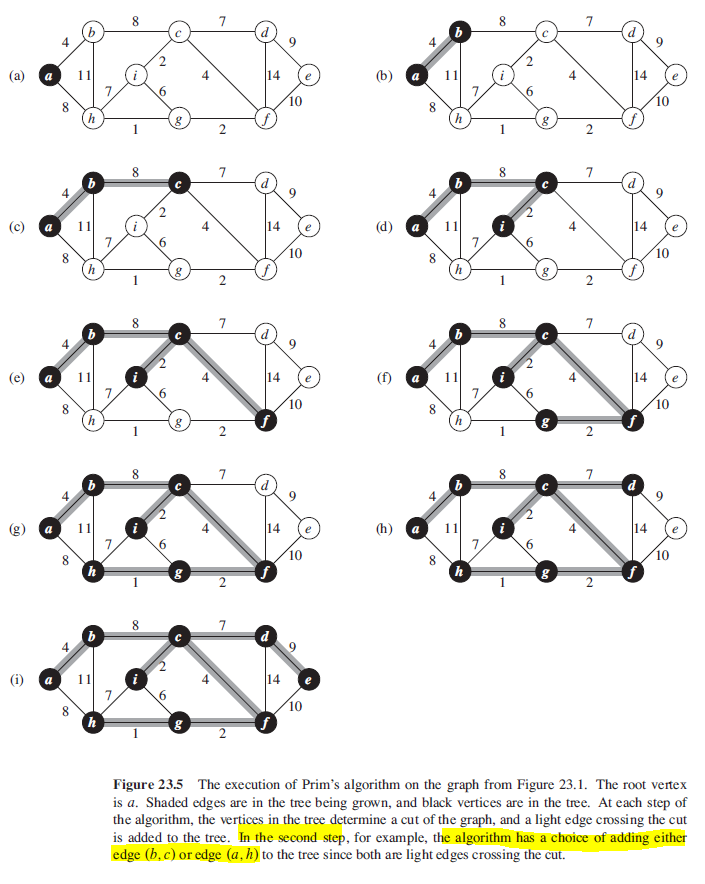
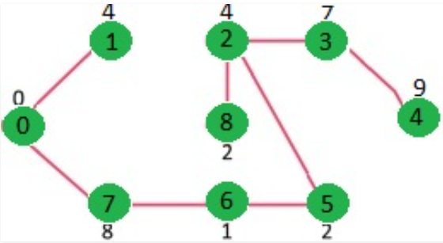

## Prim's Algorithm (Greedy)

Prim's algorithm has the property that the edges in set A always form a single tree. Tree starts from an arbitrary root and grows until the tree spans all the vertices. Qualifies as greedy since at each step, it adds to the tree an edge that contributes the minimum amount possible to tree's weight.

Starts with an empty spanning tree that maintains two sets of vertices; first contains vertices included in MST, and the other not yet included in MST with minimal weight. At every step, it considers all the edges that connect the two sets, and picks the minimum weight edge from these edges. After picking the edge, it moves the other endpoint of the edge to the set containing MST. Has time complexity of O(n^2). Algorithm as follows:

1.  Create a set mstSet that keeps track of vertices already in MST.
2.  Assign a key value to all vertices in graph; initialize all as INFINITE and assign 0 to the first vertex.
3.  Pick a vertex U not inside mstSet and has minimum key value, and update key value of all adjacent vertices.
4.  If weight of edge U-V < V, update key value as weight of U-V.

### Algorithm

```
// r is root
// A = {(v,v.predecessor): v E V - {r} - Q}

mstPrim(G,w,r) {
    for each u E G.V
        u.key = INFINITY
        u.predecessor = NIL

    r.key = 0
    // Q is a min-prority queue
    Q = G.V
    while Q != EMPTY
        u = extractMin(Q)
        for each v E G.adj[u]
            if V is element of Q and w(u,v) < v.key
                v.predecessor = u
                v.key = w(u,v)
}
```

### Figure



### Example

1. Keys assigned to vertices as {0, INF, INF, INF, INF, INF, INF, INF}.
2. Vertex 0 is picked and included in mstSet.
3. Adjacent vertices are 1 and 7 and key values are updated as 4 and 8 respectively.
4. Vertex with minimum key value (1) is picked and added to mstSet which becomes {0, 1}.
5. Adjacent vertices are 7 and 8 which both have key values of 8; can pick either one.
6. Repeat until mstSet contains all vertices of given graph.
7. Final mstSet becomes {0, 1, 7, 6, 5, 2, 8, 3, 4}.


