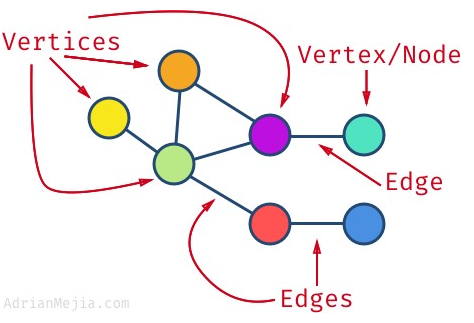
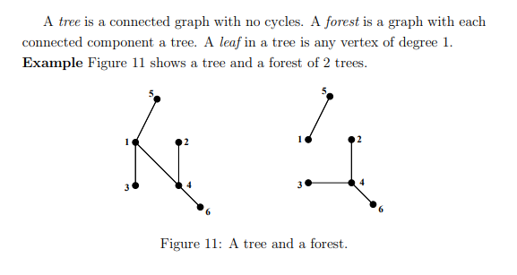
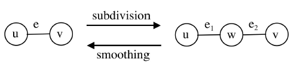
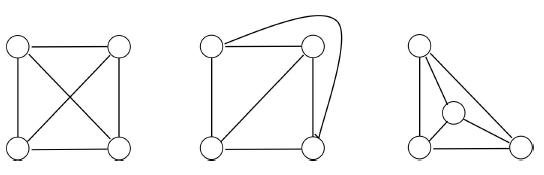

## Graphs

A graph is a data structure where a node can have zero or more adjacent elements. Consists of series of nodes. Terminology as follows:

- Edge: Connection between two nodes.
- Vertices: Alternative term for nodes/vertex; can have edges that connect to itself i.e. self-loop.
- Degree: Number of edges connected to a vertex.
- Path: Sequence of nodes such that Vi and Vi+1 are connected by an edge for 1<=i<= n-1.
- Neighbors: When two vertices are connected by an edge.
- Adjacent: Two edges that have a vertex in common.

Not all vertices have to be connected in the graph. Can have isolated nodes or separated subgraphs.

https://adrianmejia.com/data-structures-for-beginners-graphs-time-complexity-tutorial/#Depth-first-search-DFS-Graph-search

### Data Structure

### Types of Graphs

- Simple: Graph with no self-loops and no more than one edge connecting any pair of vertices.
- Weighted: Edges have values/cost assigned to them; if absent, can assume it is 1.
- Undirected: Edges are bi-directional i.e. can be viewed as going both ways.
- Directed (Digraphs): Edges have a direction i.e. indicated by arrows.
- Cyclic: Graph with cycles i.e. can get same node more than once.
- Acyclic: Graph without cycles.
- Connected: All nodes have at least one edge.
- Sparse: Few connections in graph.
- Dense: Many connections i.e. close to max number of links.
- Complete: All nodes are connected to all other nodes i.e. each node has (#nodes-1) edges.

## Tree and Forest

A tree is an undirected, connected and acyclic graph. Has n vertices with (n-1) edges. For directed graphs, notion of connectedness has two versions:

- Weakly Connected: there is either a path from A to B or B to A.
- Strongly Connected: there are paths leading both ways.

A forest is an undirected, disconnected acyclic graph i.e. a disjoint collection of trees.

### Figure

## Weighted Graph Application

| Application      | Node/Vertex       | Edges                               | Weight                          |
| ---------------- | ----------------- | ----------------------------------- | ------------------------------- |
| Social Networks  | User              | Connection with other users         | Relationship                    |
| Airline Traffic  | Airport           | Direct flights between two airports | Distance between two airports   |
| GPS Navigation   | Road intersection | Road                                | Time taken between destinations |
| Networks Routing | Server            | Data link                           | Connection speed                |

## Relations Between Graphs

Two graphs are said to be **isomorphic** if they contain the same number of vertices with same pattern of adjacency i.e. there is bijection between their vertices which perseves the adjacency relations.

A **subgraph** of G is defined as any graph that has a vertex set which is a subet of G. A **supergraph** of G is defined as any graph which has G as a subgraph.

If nodes U and V are connected by edge E, and U and W are connected by edge E1, and W and V are connected by edge E2, then both E1 and E2 are subdivions of E. **Smoothing** refers to a process of removing vertex (W) which leaves an edge connecting the remaining adjacent vertices.

  

A subdivision of graph G can be defined as a graph resulting from the subdivision of edges in G. Two graphs G and H can be defined as **homeomorphic** if there is a graph isomorphism from some subdivision of G to some subdivision of H.

An **edge contraction** removes an edge from a graph and merges the two vertices previously connected by it. This can lead to multiple edges between a pair of vertices, or self-loops connecting a vertex to itself.

## Planarity

A planar graph is one that can be embedded in a plane i.e. can be drawn on a sheet of paper in such a way that no edges cross each other. This is important in applications such as printed circuit design. Though planar graphs can have edges that cross each other, they can be transformed by moving vertices or deforming the edges.

  

To prove a finite graph is planar, it must not contain a subgraph that is homeomorphic to, or a subdivision of K5 (fully connected graph with five vertices) or K3,3 (three vertices fully connected to three other vertices).
