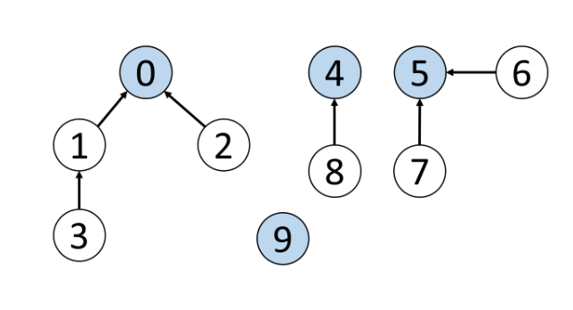
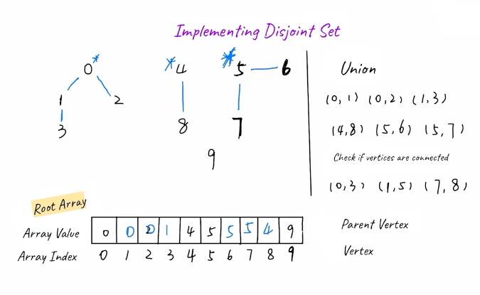

## Union-Find Algorithm (Disjoint-Set)

Given the vertices and edges between them, how could we quickly check whether two vertices are connected? We can do so by using the disjoint-set data structure (others might refer to as an algorithm).



Disjoint-set is a data structure that keeps track of a set of elements partitioned into several disjoint (non-overlapping) subsets i.e. a disjoint set is a group of sets where no item can be in more than one set.

The primary use of disjoint sets is to address the connectivity between the components of a network. The “network“ here can be a computer network or a social network. For instance, we can use a disjoint set to determine if two people share a common ancestor.

Can be used to check whether an undirected graph contains cycle or not. Performs two operations on such data structure.

https://leetcode.com/explore/learn/card/graph/618/disjoint-set/3881/

## Implementation

Implementing disjoint-set requires an additional auxillary data structure which is an array. For a given array, need to keep track of:

- The value (Corresponds to the parent vertex)
- The index (corresponds to the vertex)

For each vertex:

1. Choose a parent node and update the array correspondingly
2. A node is a root node if its values and index are matched
3. For connecting 2 disjoint-sets, need to change the parent of the root node in one set



There are two important functions in a disjoint-set:

- find(): Finds the root node of a given vertex
- union(): Unions two vertices and makes their root nodes the same

### Find

Determines which subset a particular element is in and returns the representative of that particular set. Can be used to check if two elements are in the same subset i.e. if two elements are in the same set, they have the same representation, else they belong to different sets.

### Union

Merges two subsets into a single subset. Have to check if two subsets belong to the same set; if true, union cannot be performed.

## Example

```
// consider 10 disjoint sets
{1}, {2}, {3} ... {9}, {10}

// union(1,2), union(3, 4), union(4, 8), union(9, 3)
S1 = {1, 2}
S3 = {9, 3, 4, 8} // connected nodes

// find(8, 9)
Find(8, 9) = true // though not connected directly, there exists a path connecting 8 and 9
```

```py
class DisjointSet:
    parent = {}

    # perform MakeSet operation
    def makeSet(self, universe):
        # create `n` disjoint sets (one for each item)
        for i in universe:
            self.parent[i] = i

    # Find the root of the set in which element `k` belongs
    def Find(self, k):
        # if `k` is root
        if self.parent[k] == k:
            return k
        # recur for the parent until we find the root
        return self.Find(self.parent[k])

    # Perform Union of two subsets
    def Union(self, a, b):
        # find the root of the sets in which elements
        # `x` and `y` belongs
        x = self.Find(a)
        y = self.Find(b)

        self.parent[x] = y
```
