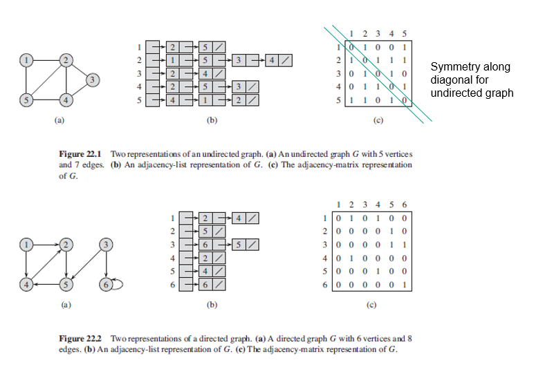

## Graphs Representations

Two standards ways to represent a directed/undirected graph G = (V,E) where V and E are arrays of vertex and edges respectively: a collection of adjacency lists or matrix. As the adjacency-list provides a compact way to represent sparse graphs i.e. |E| << |V^2|, it is usually the method of choice. For dense graphs i.e. |E| is close to |V^2|, matrix is perferred.

### Figure



### Adjacency-List

Consists of an array of |V| lists, one for each vertex in V. Size of array is equal to the number of vertices. Index of the array represents a vertex and hence, size of array is |V|. Saves space as we only need to store the values for the edges. However, finding whether an edge exist between vertexes u and v is not efficient as all the connected nodes must be first explored.

For a directed graph, the sum of the lengths of all the adjacency lists is |E|. For an undirected graph, the sum of the lengths of all adjacency lists is 2|E|, since if (u,v) is an undirected edge, then u appears in v's adjacency list and vice versa.

Adjacency lists can be readily adapted to represent weighted graph, typically given by a weight function w. The weight w(u,v) of edge (u,v) is stored in u's adjacency list with vertex v (stored as a pair). The adjacency-list representation is quite robust in that we can modify it to support many other graph variants.

Can also be represented using a hashmap.

```js
// as hashmap
const graph = {
  a: ["a", "b"],
  b: ["c"],
  c: ["d"],
  d: ["b", "c"],
};
```

### Adjacency-Matrix

Consists of |V| \* |V| matrix whereby Aij = 1 if (i,j) are elements of E, else 0. Requires |V|^2 memory, independent of the number of edges.

For undirected graphs, has symmetry along the main diagonal as (u,v) and (v,u) represent the same edge i.e. A = A^T of its transpose. Hence, some applications would simply store the entries on and above the diagonal and cutting memory needed by half.

For representing weighted graphs, the weight w (u,v) of edge (u,v) is stored as the entry in row u and column v. If edge does not exist, can store as 0 or -INFINITY.

## Representing Attributes

Most algorithms that operate on graphs need to maintain attributes for vertices/edges. However, there is no one best way to store and access vertex/edge attributes in real programs. For instance, in OOP languages, vertex attributes might be represented as instance variables within a subclass of a Vertex class.

```
v.d         Attribute d of a vertex v
(u,v).f     Edge of u and v with an attribute f
```
