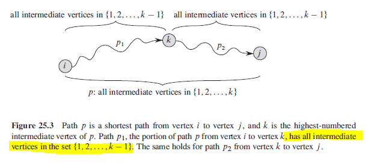
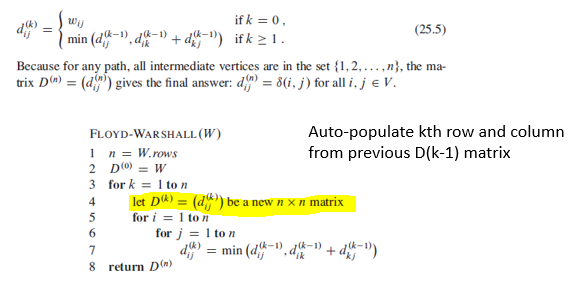
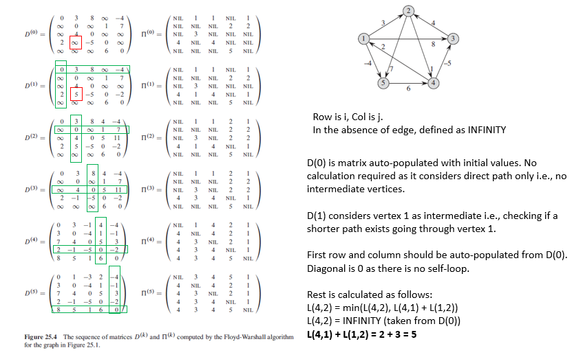

## Floyd Warshall

This algorithm considers all vertices as an intermediate vertex. For every vertex pair (i,j):

- k is not an intermediate in shortest path from i to j.
- k is an intermediate. d(i,j) is updated if > d(i,k) + d(k,j).

Time complexity is O(n^3) as it involves three nested for loops. Thought it has same time complexity as Dijkstra's, it will be faster as it performs fewer instructions per loop.

### Intermediate

### Algorithm

### Figure

