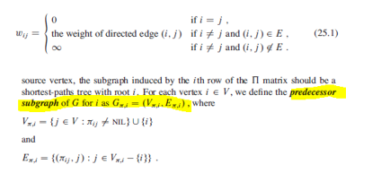

## All-Pairs Shortest Paths

This problem might arise in making a table of distances between all pairs of cities for a road atlas. For every pair of vertices, we wish to find the shortest (least-weight) path from u to v, where the weight of a path is the sum of the weights of its constituent edges. Typically would want the output in tabular form: the entry in u's row and v's column should be weight of a shortest path from u to v.

Can solve all-pairs shortest paths problem by running a single-source shortest-paths algorithm |V| times, once for each vertex as the source. Has time complexity of O(n^3). However, can be done better. Using an adjacency matrix representation:

- Input: nXn matrix W, representing the edge weights of an n-vertex directed graph G = (V,E).
- Output: nXn matrix D = (Dij), where entry Dij contains the weight of a shortest path from vertex i to j.
- Predecessor: Pij, where Pij = NIL if i=j, or if there is no path from vertex i to j.



```
printAllPairsShortestPath(P, i, j) {
  if i == j
    print i
  elseif Pij == NIL
    print "no path from {i} to {j} exists"
  else
    printAllPairsShortestPath(P, i, Pij)
    print {j}
}
```

## Dynamic Programming Algorithm

Can use Dynamic Programming to solve this problem. Each major loop of the dynamic program will invoke an operation that is very similar to matrix multiplication, so that the algorithm will look like repeated matrix multiplication.

Between two vertices i and j, there may exist a shorter path whereby d(i,j) > d(i,k) + d(k,j). Hence, for each vertex, need to check if going through it will shorten the path. Let Lij ^(m) be the minimum weight of any path from vertex i to j that contains at most m edges.

```
// W is the adjacency matrix representation
// L is a matrix containing shortest paths

extendShortestPaths(L,W){
  n = L.rows
  let L' be a new n X n matrix
  for i = 1 to n
    for j = 1 to n
      L'ij = INFINITY
      for k = 1 to n
        L'ij = min(L'ij, Lik + wkj)
}
```
