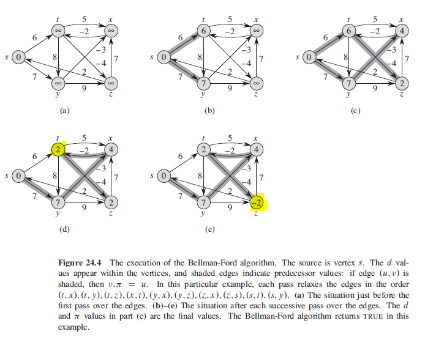

## Bellman-Ford Algorithm

Solves single-source shortest-paths problem in the general case in which edges can have negative weight. Is simple and has the further benefit of detecting whether a negative-weight cycle is reachable from the source by returning a boolean value. If there is such cycle, the algorithm indicates that no solution exists. Has time complexity of O(VE).

Uses dynamic programming to solve the problem in bottom-up manner i.e. first calculcates the shortest distances which have at-most one edge in the path, then it calculcates the shortest path with at-most two edges, and etc.

## Algorithm

```
bellmanFord(G,w,s){
    initializeSingleSource(G,s)
    for i=1 to |G.V| - 1
        for each edge (u,v) E G.E
            // G.E is a set of all the edges, iterates through each of them
            // for each pass, each edge is relaxed once
            relax(u,v,w)

    // check if graph contains no negative-weight cycles
    for each edge (u,v) E G.E
        if v.d > u.d + w(u,v)
            return FALSE
    return TRUE
}
```

## Figure



## Sequence

### First Iteration

```
//before
INF INF INF INF 0
t   x   y   z   s

(t,x) = INFINITY + 5 = INFINITY
(t,y) = INFINITY + 8 = INFINITY
(t,z) = INFINITY - 4 = INFINITY
(x,t) = INFINITY
(y,x) = INFINITY
(y,z) = INfINITY
(z,x) = INFINITY
(z,s) = INFINITY
(s,t) = 0 + 6 = 6 < INFINITY (t updated to 6)
(s,y) = 0 + 7 = 7 < INFINITY (y updated to 7)

//after
6   INF 7   INF 0
t   x   y   z   s
```

### Second Iteration

```
6   INF 7   INF 0
t   x   y   z   s

(t,x) = 6 + 5 = 11 < INFINITY (x updated to 11)
(t,y) = 6 + 8 = 14 > 7 (no change)
(t,z) = 6 - 4 = 2 < INFINITY (z updated to 2)
(x,t) = 11 - 2 = 9 > 6 (no change)
(y,x) = 7 - 3 = 4 < 11 (x updated to 4)
(y,z) = 7 + 9 = 16 > 2 (no change)
(z,x) = 2 + 7 = 9 > 4 (no change)
(z,s) = 2 + 2 = 4 > 0 (no change)
(s,t) = 0 + 6 = 6 (no change)
(s,y) = 0 + 7 = 7 (no change)

6   4   7   2   0
t   x   y   z   s
```

### Third Iteration

```
6   4   7   2   0
t   x   y   z   s

(t,x) = 6 + 5 = 11 > 4 (no change)
(t,y) = 6 + 8 = 14 > 7 (no change)
(t,z) = 6 - 4 = 2 (no change)
(x,t) = 4 - 2 = 2 < 6 (t updated to 2)
(y,x) = 7 - 3 = 4 (no change)
(y,z) = 7 + 9 = 16 > 2 (no change)
(z,x) = 2 + 7 = 9 > 4 (no change)
(z,s) = 2 + 2 = 4 > 0 (no change)
(s,t) = 0 + 6 = 6 (no change)
(s,y) = 0 + 7 = 7 (no change)

2   4   7   2   0
t   x   y   z   s
```

### Fourth Iteration

```
2   4   7   2   0
t   x   y   z   s

(t,x) = 2 + 5 = 7 > 4 (no change)
(t,y) = 2 + 8 = 10 > 7 (no change)
(t,z) = 2 - 4 = -2 < 2 (z updated to -2)
(x,t) = 4 - 2 = 2 (no change)
(y,x) = 7 - 3 = 4 (no change)
(y,z) = 7 + 9 = 16 > -2 (no change)
(z,x) = -2 + 7 = 4 (no change)
(z,s) = -2 + 2 = 0 (no change)
(s,t) = 0 + 6 = 6 (no change)
(s,y) = 0 + 7 = 7 (no change)

2   4   7   -2  0
t   x   y   z   s
```
