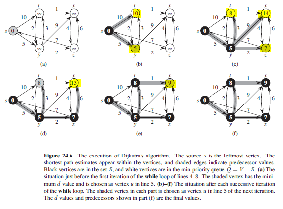

## Dijkstra

Solves single-source shortest-paths problem on a weighted, directed graph for the case in which all edge weights are non-negative. Algorithm maintains a set S of vertices whose final shortest-path weights from source s have already been determined. A greedy strategy as it always chooses the "lightest" or "closest" vertex in V-S to add to set S. Has time complexity of O((V+E)lgV) with min-priority queue, and O(n^2) without.

## Improving Estimates

General idea is to look systematically for shortcuts.

```
// given three vertices s, u, z where s is the starting point
if (D[u] + weight[u][z] < D[z])
    D[z] = D[u] + weight[u][z]
```

## Algorithm

```
dijkstra(G,w,s){
  initializeSingleSource(G,s)
  S = {}
  Q = G.V   // min-priority queue
  while Q != EMPTY
    u = extractMin(Q)
    S = S U {u}
    for each vertex v E G.Adj[u]
      // updates estimates v.d and v.predecessor
      // if shortest path to v can be improved by going through u
      relax(u,v,w)
      // change priority of vertex v in queue
}
```

## Figure



## Sequence

### First Iteration

```
(s,t) = 10
(s,y) = 5 (choose y)

// shortest path weights determined: {y}
```

### Second Iteration

```
(y,t) = 5 + 3 = 8 (update t)
(y,x) = 5 + 9 = 14
(y,z) = 5 + 2 = 7
(s,t) = 10

// choose (y,z) as it has smallest weight of 2
// shortest path weights determined: {y,z}
```

### Third Iteration

```
(z,x) = 7 + 6 = 13 (update x)
(z,s) = 7 + 7 = 14
(y,t) = 5 + 3 = 8
(y,x) = 5 + 9 = 14
(s,t) = 10

// choose (y,t) as it has the smallest weight of 3
// shortest path weights determined: {y,z,t}
```

### Fourth Iteration

```
(t,x) = 8 + 1 = 9 (update x)
(t,y) = 8 + 2 = 10
(z,x) = 7 + 6 = 13
(z,s) = 7 + 7 = 14
(y,x) = 5 + 9 = 14
(s,t) = 10

// choose (t,x) as it has the smallest weight of 1
// shortest path weights determined: {y,z,t,x}
```
