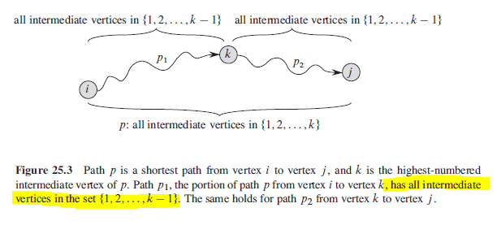
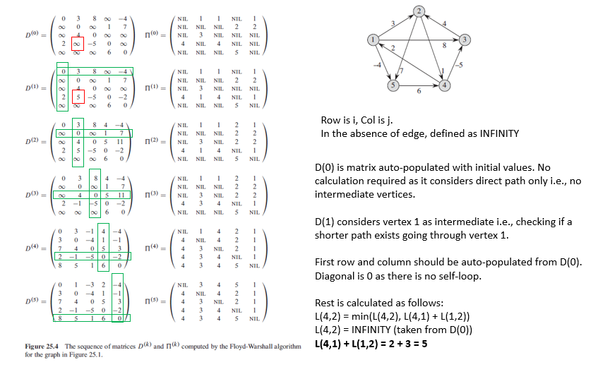
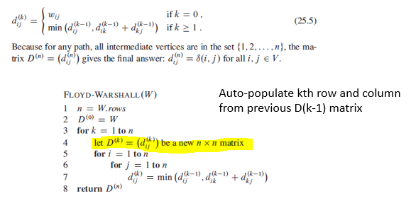

## Floyd-Warshall

The Floyd-Warshall algorithm finds the shortest paths in a weighted graph with positive or negative edge weights, as long as there are no negative cycles. Unlike algorithms that compute shortest paths from a single source, Floyd-Warshall computes the shortest paths between all pairs of vertices in the graph.

This algorithm takes a fundamentally different approach by computing all-pairs shortest paths in one go, rather than separately for each source. We start by initializing a distance matrix where direct connections between cities are filled with their edge weights, and all other distances are set to infinity. The distance from a city to itself is set to zero. This matrix serves both as our working space and our final result.

The core of the our algorithm involves three nested loops. The outermost loop iterates through all vertices, considering each as a potential intermediate point on the shortest path between every other pair of vertices. For each pair of vertices (i, j), we check if passing through the current intermediate vertex k offers a shorter path than we currently know. If it does, we update the distance.

This iterative process gradually refines our shortest paths. By the time all vertices have been considered as intermediates, we have determined all shortest paths. After running Floyd-Warshall, our distance matrix contains all the information needed. We can directly count reachable cities for each source and select our answer, similar to previous approaches.

Floyd-Warshall has several advantages: it solves the all-pairs shortest path problem directly with a simple and elegant one-pass implementation. For dense graphs, its time complexity of O(V^3) can be more efficient than running algorithms like Dijkstra’s or SPFA multiple times. However, for sparse graphs or when only a few sources are involved, other algorithms might be more efficient.

### Algorithm

This algorithm considers all vertices as an intermediate vertex. For every vertex pair (i,j):

- k is not an intermediate in shortest path from i to j
- k is an intermediate; d(i,j) is updated if > d(i,k) + d(k,j)

Time complexity is O(n^3) as it involves three nested for loops. Thought it has same time complexity as Dijkstra's, it will be faster as it performs fewer instructions per loop.







### Example

```py
class Solution:
    def findTheCity(
        self, n: int, edges: List[List[int]], distanceThreshold: int
    ) -> int:
        # Large value to represent infinity
        INF = int(1e9 + 7)
        # Distance matrix to store shortest paths between all pairs of cities
        distance_matrix = [[INF] * n for _ in range(n)]

        # Initialize distance matrix
        for i in range(n):
            distance_matrix[i][i] = 0  # Distance to itself is zero

        # Populate the distance matrix with initial edge weights
        for start, end, weight in edges:
            distance_matrix[start][end] = weight
            distance_matrix[end][start] = weight  # For undirected graph

        # Compute shortest paths using Floyd-Warshall algorithm
        self.floyd(n, distance_matrix)

        # Find the city with the fewest number of reachable cities within the distance threshold
        return self.get_city_with_fewest_reachable(
            n, distance_matrix, distanceThreshold
        )

    # Floyd-Warshall algorithm to compute shortest paths between all pairs of cities
    def floyd(self, n: int, distance_matrix: List[List[int]]):
        # Update distances for each intermediate city

        for k in range(n):
            for i in range(n):
                for j in range(n):
                    # Update shortest path from i to j through k
                    distance_matrix[i][j] = min(
                        distance_matrix[i][j],
                        distance_matrix[i][k] + distance_matrix[k][j],
                    )

    # Determine the city with the fewest number of reachable cities within the distance threshold
    def get_city_with_fewest_reachable(
        self, n: int, distance_matrix: List[List[int]], distance_threshold: int
    ) -> int:
        city_with_fewest_reachable = -1
        fewest_reachable_count = n

        # Count number of cities reachable within the distance threshold for each city
        for i in range(n):
            reachable_count = sum(
                1
                for j in range(n)
                if i != j and distance_matrix[i][j] <= distance_threshold
            )
            # Update the city with the fewest reachable cities
            if reachable_count <= fewest_reachable_count:
                fewest_reachable_count = reachable_count
                city_with_fewest_reachable = i
        return city_with_fewest_reachable
```

```py
class Solution:
    def minimumCost(self, source: str, target: str, original: List[str], changed: List[str], cost: List[int]) -> int:
        charHash = {}
        dp = []
        nodes = "abcdefghijklmnopqrstuvwxyz"

        # initialize charHash and dp
        for idx, char in enumerate(nodes):
            charHash[char] = idx
            dp.append([math.inf] * 26)

        # populate dp
        for i in range(len(original)):
            sourceIdx = charHash[original[i]]
            destIdx = charHash[changed[i]]
            dp[sourceIdx][destIdx] = min(cost[i], dp[sourceIdx][destIdx])

        self.floyd(nodes, charHash, dp)

        cost = 0
        for i in range(len(source)):
            if source[i] == target[i]: continue
            temp = dp[charHash[source[i]]][charHash[target[i]]]
            if temp == math.inf: return -1
            cost += temp

        return cost

    def floyd(self, nodes, charHash, dp):
        for mid in nodes:
            for source in nodes:
                for dest in nodes:
                    dp[charHash[source]][charHash[dest]] = min(
                        dp[charHash[source]][charHash[dest]],
                        dp[charHash[source]][charHash[mid]] + dp[charHash[mid]][charHash[dest]],
                    )
```
