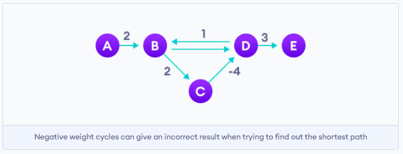
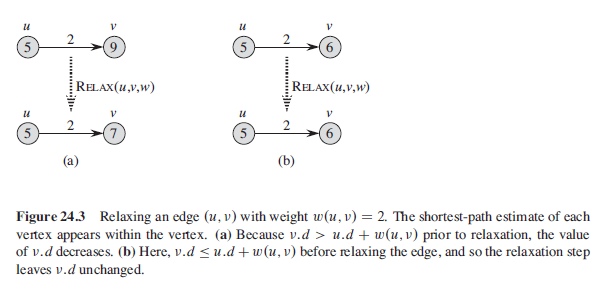
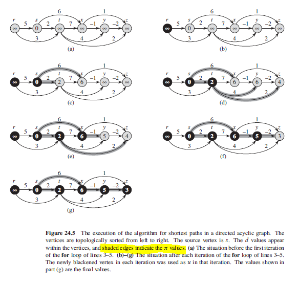

## Optimal Substructure

Shortest-paths algorithms typically rely on the property that a shortest path between two vertices contains other shortest paths within it.

## Negative-Weight Edges

Some instances of the single-source shortest-paths problem may include edges whose weights are negative. If the graph contains a negative-weight cycle reachable from source s, then shortest-path weights are not well defined i.e. no path from s to a vertex on the cycle can be a shortest path.

## Cycles

A shortest path cannot contain a negative-weight cycle, nor can it contain a positive-weight cycle. When we are finding shortest paths, we assume they have no cycles i.e. they are simple paths.

Negative-weight edges can create negative-weight cycles i.e. a cycle that will reduce the total path distance by coming back to the same point.

### Figure



## Representing Shortest Paths

Shortest paths are represented by maintaining a "predecessor" property for each vertex.

## Relaxation

The process of relaxing an edge (u,v) consists of testing whether we can improve the shortest path to v found so far by going through u and, if so, updating v.d and v.predecessor. A relaxation step may decrease the value of the shortest path estimate and update v's predecessor attribute.

Algorithms described will each call initializeSingleSource() and then repeatedly relaxes edges.

```
initializeSingleSource(G,s) {
    for each vertex v E G.V
        v.d = INFINITY  // shortest-path estimate
        v.predecessor = NIL
    s.d = 0
}
```

```
// the only means by which shortest-path estimates and predecessors are changed

relax(u,v,w) {
    if v.d > u.d + w(u,v)
        v.d = u.d + w(u,v)
        v.predecessor = u
}
```

### Figure



## Directed Acyclic Graphs (DAG)

By relaxing the edges of a weighted DAG, according to a topological sort of its vertices, we can compute the shortest paths from a single source in O(V+E).

An interesting application of this algorithm arises in determining critical paths in PERT chart analysis (Program Evaluation and Review Technique). Edges represent jobs to be performed, and edge weights represent time required to perform them. A critical path is a longest path through DAG, corresponding to the longest time to perform a sequence of jobs. Hence, critical path can be found either:

- Negating the edge weights and running DAGShortestPaths() or,
- Running DAGShortestPaths() but replacing INFINITY with -INFINITY, and > with < in relax().

```
DAGShortestPaths(G,w,s){
    sort vertices of G topologically
    initializeSingleSource(G,s)
    for each vertex u, taken in topologically sorted order
        for each vertex v E G.Adj[u]
            relax(u,v,w)
}
```

### Figure


