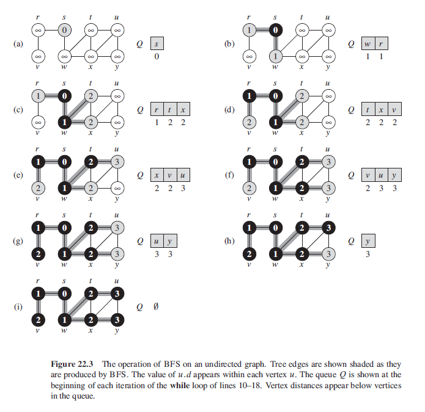

## Breadth-First Search (BFS)

Systematically explores the edges of graph to discover every vertex that is reachable from souce node x. Algorithm first discovers all vertices at distance k from x before discovering any vertices at distance k+1. Prim's MST and Dijkstra's shortest path algorithms use ideas similar to BFS.

### Algorithm (Pseudo)

Algorithm as follows:

- Start from an initial vertex.
- Visit all adjacent nodes/neighbors one by one by placing them in an initially empty queue (FIFO).
- Remove first vertex from queue and one by one put its neighbours at end of queue.
- Once vertex is visited, set done[j] as true.
- Only add vertex to queue if done[j] is false.
- Repeat until queue is empty.

```
// vertices start out white
// when discovered, it becomes grey
// when all vertices adjacent to a vertex have been discovered, it becomes black

BFS(G,s) {
    for each vertex u E G.V - {s}
        u.color = WHITE
        u.d = INFINITY
        u.pi = NIL

    s.color = GRAY
    s.d = 0
    s.predecssor = NIL
    Q = new Queue()
    enqueue(Q,s)

    while !Q.empty
        u = dequeue(Q)
        for each v E G.adj[u]
            // find all adjaccent nodes of u
            if v.color == WHITE
                v.color = GRAY
                v.d = u.d + 1
                v.predecessor = u
                enqueue(Q,v)

        u.color = BLACK
}
```

### Figure


