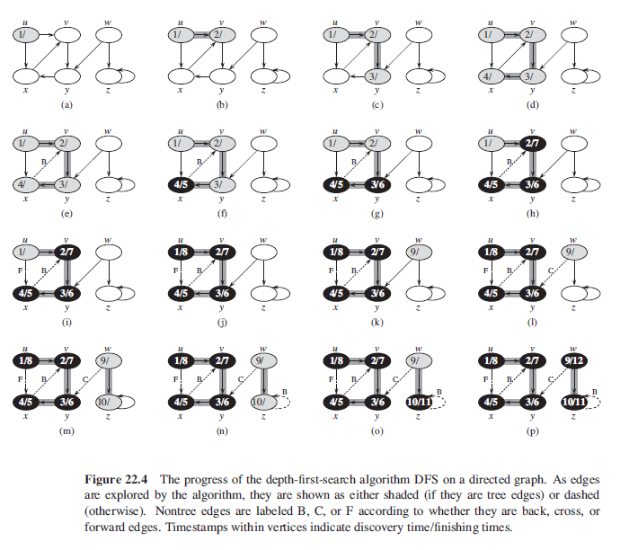
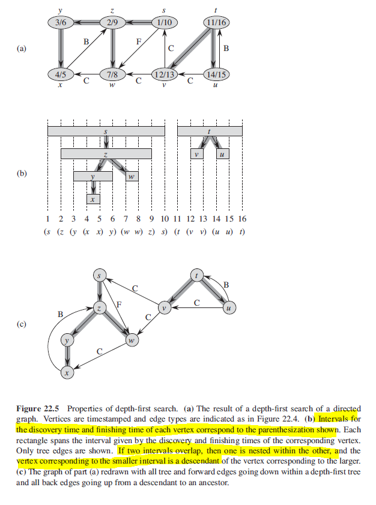

## Depth-First Search (DFS)

Strategy involves searching deeper into the graph whenever possible i.e. explores edges out of the most recently discovered vertex v that still has unexplored edges leaving it. Once all v's edges have been explored, the search "backtracks" to explore edges leaving the vertex from which v was discovered. A way to navigate a graph from an initial vertex by recursively calling the first adjacent node of each vertex found. Has time complexity of O(V+E).

- Start from an initial vertex.
- Put vertex on a stack (FILO).
- Take the item from stack, mark it as done, look up its neighbours and add them onto the stack.
- Repeatedly pop the next vertex from the stack and repeat previous step.

Results of DFS depends upon the order in which the vertices are examined.

A standard DFS implementation puts each vertex of the graph into one of two categories: visited and not visited. The purpose of the algorithm is to mark each vertex as visited while avoiding cycles.

### Algorithm

```
// colors BLACK when adjacency list has been examined completelyy

dfs(G) {
    for each vertex u E G.V
        // colors each vertex initially as WHITE
        u.color = WHITE
        u.predecessor = NIL

    // time is global variable
    time = 0
    for each vertex u E G.V
        if u.color == WHITE
            // explore edges (u,v)
            dfsVisit(G,u)
}
```

```
// timestamps each vertex
// first v.d records when v is first discovered
// second v.f records when search finishes examining v's adjacency list
// provides impt information about structure of graph

dfsVisit(G,u) {
    // white vertex u has just been discovered
    time = time + 1
    u.d = time
    u.color = GRAY

    for each v E G.Adj[u]
        // explore edges (u,v)
        if v.color == WHITE
            v.predecessor = u
            dfsVisit(G,v)

    u.color = BLACK
    time = time + 1
    u.f = time
}
```

### Figure



### Figure (Timestamps)

All tree and forward edges head downward in a depth-first tree and all back edges go up.



## Classification of Edges

DFS can be used to classify the edges of the input graph G = (V,E). For example, a directed graph is acyclic if and only if DFS yields no "back" edges. When exploring edges in DFS, the color tells us as follows:

1. WHITE indicates a tree edge.
2. GRAY indicates a back edge.
3. BLACK indicates a forward or cross edge.

### Tree Edges

Edge (u,v) is a tree edge if v was first discovered by exploring edge (u,v).

### Back Edges

Back edges are those edges (u,v) connecting a vertex u to an ancestor v in a depth-first tree. Self-loops are considered, which may occur in directed graphs, to be back edges.

### Forward Edges

Nontree edges (u,v) connecting a vertex u to a descendant v in a depth-first tree.

### Cross Edges

Cross edges are all other edges.
