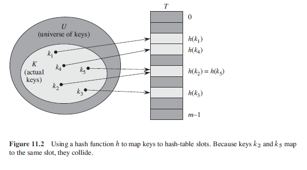
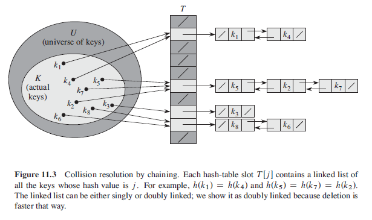

## Hash Tables

Hash table is an effective data structure for implementing dictionaries which supports INSERT, SEARCH and DELETE operations without the need for ordering. Although searching for an element can take as long as O(n), hashing performs extremely well. Under reasonable assumptions, average time complexity to search for an element is O(1). Nonetheless, it requires more memory and is more complicated to implement. Hence, at the expense of using more memory, can speed up table operations. Hash table generalizes the simpler notion of an ordinary array:

- Uses an array of size proportional to the number of keys stored.
- Instead of using key as an array index, index is computed from the key.
- Can use "chaining" to avoid collisions i.e. multiple keys mapping to same index.

## Hashing

With direct addressing, element with key k is stored in slot k. With hashing, element is stored in slot h(k) whereby h() is hash function to compute the slot from key k.



## Chaining

In hash table, two keys may hash to the same slot which would result in a collision. This can be resolved through chaining. In chaining, all elements that hash to the same slot are placed into the same linked list.

### Algorithm (Pseudo)

```
chainedHashInsert(T,x) {
    insert x at head of list T[h(x.key)]
}

chainedHashSearch(T,k) {
    search for an element with key k in list T[h(k)]
}

chainedHashDelete(T,x) {
    delete x from list T[h(x.key)]
}
```

### Figure



## Load Factor

To compute computational efficiency of hash table, need a way of quantifying how full the table is, so that we can compute the probabiltiy of collisions, and how much effort is needed to deal with them.

For hash table of size m with n entries, load factor is simply n/m. Probability of collision occurs for next key is load factor i.e. if 25% full, probability of collision is 25% for next key. Hence, to minimize collisions, need keep load factor low (50% is often quoted as good maximum).
