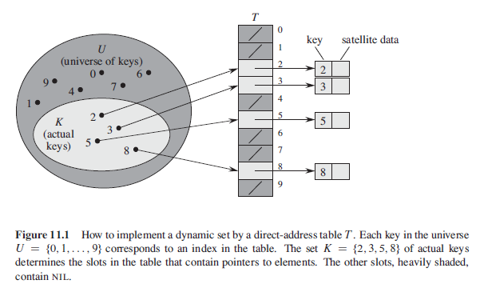

## Direct-Address Tables

A simple technique that works well when the universe of keys is reasonably small and unique. Each key corresponds to an index or slot in the array. However, if the universe U gets too large, storing a table of size U may be impractical and impossible for given memory. Moreover, the set K of keys actually stored may be small relative to U and hence, most of the space allocated for the table would be wasted.

### Algorithm (Pseudo)

```
directAddressSearch(T,k) {
    return T[k]
}

directAddressInsert(T,x) {
    T[x.key] = x
}

directAddressDelete(T,x) {
    T[x.key] = NIL
}
```

### Figure


