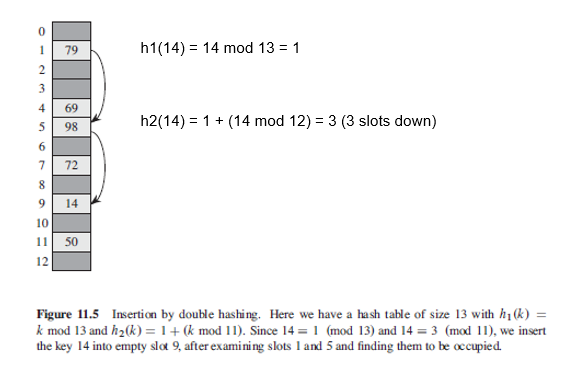
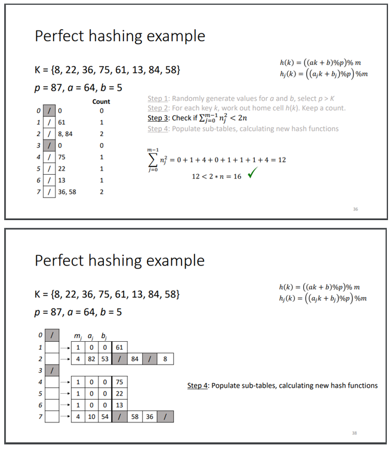
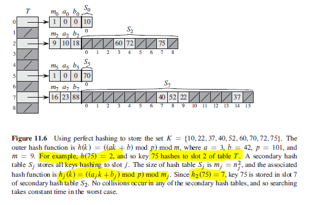

## Hash Functions

A good hash function satisfies the assumption of simple uniform hashing: each key is equally likely to hash to any of the m slots, independently of where any other key has hashed to. Also, one would minimize the chance that such variants hash to the same slot. However, there is no way to check this condition. In practice, can employ heuristic schemes which includes hashing by division or multiplication.

## Intepreting Keys as Natural Numbers

Most hash functions assume that the universe of keys is a natural number. Hence, need to convert them if they are not i.e. string. For strings, can express them in suitable radix notation (base of an integer of unique digits).

```
// radix-128
"pt" => (112, 116) in ASCII => (112*128) + 116 = 14452
```

## Division

Method maps a key k into one of m slots by taking the remainder of k divided by m. When using this method, need to avoid certain values of m i.e. should not be a power of 2. A good choice would be a prime number that is not too close to an exact power of 2.

```
h(k) = k mod m
```

## Multiplication

Hash function operates in two steps. Advantage of this method is that value of m is not critical. Typically choose it to be a power of 2 since it can be easily implemented on most computers.

- Multiply key k by a constant A in the range 0 < A < 1 and extract the fractional part.
- Multiply the value by m and the take the floor of the result (round down).

```
h(k) = m(kA mod 1)
```

## Universal Hashing

In universal hashing, the hash function is chosen randomly from a universal collection of hash functions that is independent of the keys that are actually going to be stored:

- Firstly, a prime number "p" is chosen whereby every possible key k is between 0 <= k <= p-1.
- Constants "a" and "b" are chosen randomly from the range between 1 up to p-1.
- With a hash function chosen randomly, chance of collision between distinct keys is no more than 1/m.

```
h(k) = ((ak + b) mod p) mod m
```

## Open Addressing

In open addressing, all elements occupy the hash table itself i.e. each table entry contains either an element or NIL and no elements are stored outside the table, unlike in chaining. For insertion, involves successively examining/probing the hash table until an empty slot is found. Easiest strategy for achieving this (linear probing) is to search for open locations by decreasing the index considered by one until an empty space is found. Better approach is to search for an empty location using secondary hash function; process is called double hashing.

### Linear Probing

For a given key, the slot given by the auxiliary hash function is probed first; if it is filled, we move up the slot by one. For keys having same index, linear probing reduces index until an empty space is found. Else, starts again at the end i.e. if index 4 is filled, searches index 3, and etc.

Though all keys can be inserted in a way that makes good use of space, we can no longer use same hash function to find a particular key. Deleting/inserting new keys also become complicated. Will also suffer from primary clustering whereby if multiple keys are hitting the same primary location, the blocks/clusters needed to be tested down the index grows larger each time.

### Double Hashing

Offers one of the best methods available for open addressing as the permutations produced have many of the characteristics of randomly chosen permutations. Applies a secondary hash function to tell us how many slots to jump to look for an empty slot if a key's primary location has been filled already.

```
h1(k) = k mod m
h2(k) = 1 + (k mod m')

// Value of h2(k) must be relatively prime for the entire hash-table to be searched
// result also cannot be a common divisor with the size of hash table
// i.e. hash table of size 10, and h2(k) returns 2/5/4/6/8, then only half of locations will be checked
// might result in failure (endless loop)
// convenient way is to let m be a power of 2 and h2(k) to return an odd number
// m' is chosen to be slightly less than m i.e. m - 1
```

### Figure



## Perfect Hashing

Hashing can also provide excellent worse-case performance when the set of keys is static i.e. once keys are stored, they never change, and there are no insertions/deletions. Some applications include reserved words in programming language, set of file names on CD-ROM, etc. Has time complexity of O(1) in worst-case. Implementation as follows:

- Perfect hashing is implemented using two hash tables, one at each level.
- Each of the table uses universal hashing.
- First level is same as for hashing with chaining i.e. hashing n keys into m slots using universal hash function.
- However, first level will produce some collisions.
- Each bin is then rehashed at second level, squaring the number of keys hashing to slot j to avoid any collision.
- Universal hashing functions are chosen based on "try out" principle.

http://www.cs.otago.ac.nz/cosc242/pdf/L11.pdf

### Choosing Universal Hash Functions (Example)

1. Choose a universal hash function and work out h(k); keep a count for each cell of how many keys are hashed.
2. Check if sum of all n^2 for each cell is > 2n (space required is too large); repeat process with new a,b for primary hash function.
3. For secondary function hh(k), set m = n^2 and choosing a and b randomly.
4. Check to make sure resulting function doesn't cause any collisions within the secondary table.



### Figure


