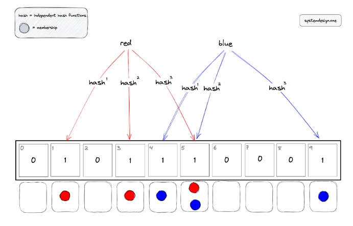

## Bloom filter

A Bloom filter is a space-efficient probabilistic data structure that is used to test whether an item is a member of a set. The bloom filter will always say yes if an item is a set member. However, the bloom filter might still say yes although an item is not a member of the set i.e. **false positive**. The items can be added to the bloom filter but the items cannot be removed.

The bloom filter supports the following operations:

- adding an item to the set
- test the membership of an item in the set

### Advantages

- Constant time complexity
- Constant space complexity
- Operations are parallelizable
- No false negatives
- Enables privacy by not storing actual items

### Disadvantages

- Doesn’t support the delete operation
- False positives rate can’t be reduced to zero
- Bloom filter on disk requires random access due to random indices generated by hash functions

## How it works

The bloom filter data structure is a bit array of length n. The position of the buckets is indicated by the index. All the bits in the bloom filter are set to zero when the bloom filter is initialized. The bloom filter discards the value of the items but stores only a set of bits identified by the execution of hash functions on the item.

### Adding an item

The following operations are executed to add an item to the bloom filter:

1. The item is hashed through k hash functions
2. The modulo n (length of bit array) operation is executed on the output of the hash functions to identify the k array positions (buckets)
3. the bits at all identified buckets are set to one

There is a probability that some bits on the array are set to one multiple times due to **hash collisions**.

### Checking membership of an item

The following operations are executed to check if an item is a member of the bloom filter:

1. The item is hashed through the same k-hash functions
2. The modulo n (length of bit array) operation is executed on the output of the hash functions to identify the k array positions (buckets)
3. Verify if **all the bits at identified buckets are set to one**

If any of the identified bits are set to zero, the item is not a member of the bloom filter. If all the bits are set to one, the item might be a member of the bloom filter as it cannot eliminate false positives.
