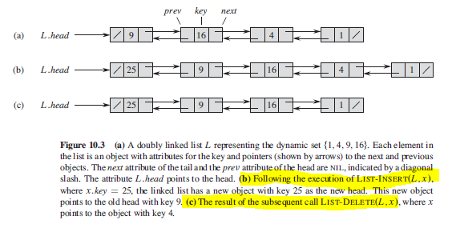
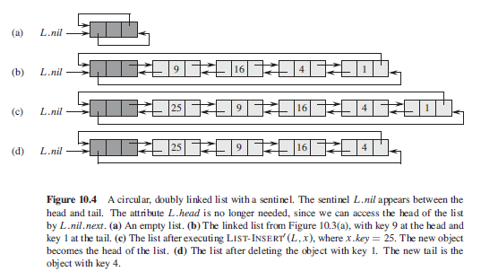
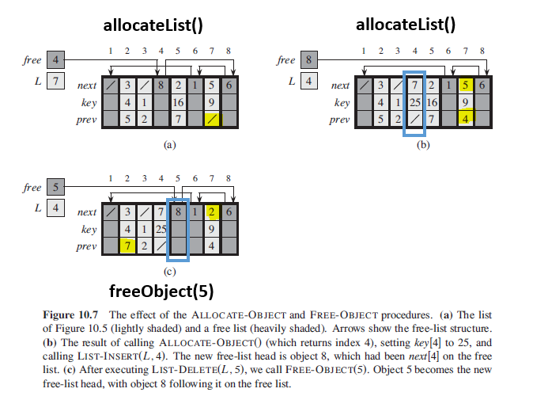

## Linked Lists

A data structure in which the objects are arranged in a linear order. Unlike an array in which the linear order is determined by the array indices, the order in a linked list is determined by a pointer in each object. Applications include image viewer with previous/next images, accessing previous/next page in borwser, and playlists in music player.

A linked list is represented by a pointer to the first node of the linked list called the head. If the linked list is empty, then the value of the head points to NULL.

### Single

Contains pointer to next element only (no prev pointer attribute). Can virtually involve anything. Non-empty lists can be represented by two-cells; first cell contains pointer to a list element and second cell contains a pointer to either the empty list or another/next two-cell element.

### Doubly

Doubly linked list is an object with an attribute key and two other pointer attributes: next and prev. Object may also contain satellite data. If x.prev = NIL, element x has no predecessor and is therefore the first element or head, and vice versa for x.prev.

### Circular

"Prev" pointer of the head of the list points to the tail, and the "next" pointer of the tail points to the head.

### Algorithm (Pseudo)

```
// time complexity of O(n)
listSearch(L,k) {
  x = L.head
  while (x != NIL and x.key != k)
    x = x.next
  return x
}

// insert operation "splices" x onto the front of the linked list
// time complexity of O(1)
listInsert(L,x) {
  x.next = L.head
  if (L.head != NIL)
    L.head.prev = x
  L.head = x
  x.prev = NIL
}

// time complexity of O(n)
listDelete(L,x) {
  if x.prev != NIL
    x.prev.next = x.next  // replacing x's position with x.next
  else
    L.head = x.next

  if x.next != NIL
    x.next.prev = x.prev
}
```

### Figure



## Sentinels

A sentinel is a dummy object that allows us to simplify boundary conditions. By providing a list with an object L.nil that represents NIL but has the attributes of the other objects in the list, whenever we have a reference to NIL in list code, we replace it by a reference to the sentinel L.nil. This converts a regular doubly-linked list into a **circular, doubly-linked list with sentinel**.

L.nil appears between head and tail i.e. L.head is no longer needed as we can access the head by L.nil.next. Similarly, we can access tail by L.nil.prev.

### Algorithm (Pseudo)

```
listSearch(L,k) {
  x = L.nil.next
  while (x != L.nil && x.key != k)
    x = x.next
  return x
}

listInsert(L,x){
  x.next = L.nil.next
  L.nil.next.prev = x
  L.nil.next = x
  x.prev = L.nil
}

listDelete(L,x) {
  x.prev.next = x.next
  x.next.prev = x.prev
}
```

### Circular, Doubly-Linked List with Sentinel



## Allocating and Freeing Objects (Doubly-Linked List)

Applies for doubly-linked lists. It is useful to manage the storage of objects not currently used in the linked-list representation so that one can be allocated. For instance, for objects stored in an array with size m, there may come a point whereby the dynamic set with size n contains n <= m elements. Since n objects represent the elements currently in dynamic set, the remaining m-n objects are considered free and and available to represent elements inserted into the dynamic set in the future. Features as follows:

- Free objects are kept in a singly-linked list (free list).
- Uses only "next" array which stores the next pointers within the list.
- Head of "free" list is stored in global variable "free".
- Free list acts like a stack whereby the next object allocated is the last one freed.
- Free list may be intertwined with doubly-linked list.

### Algorithm (Pseudo)

```
allocateObject() {
  if free == NIL
    error "out of space"
  x = free
  free = x.next
  return x
}

freeObject(x) {
  x.next = free
  free = x
}
```

### Sequence of Events



## Linked Lists vs Arrays

| Arrays                                                                                                         | Linked Lists                                                                                                                                    |
| -------------------------------------------------------------------------------------------------------------- | ----------------------------------------------------------------------------------------------------------------------------------------------- |
| A collection of elements of similar data type.                                                                 | An ordered collection of elements of same type, connected to each other using pointers.                                                         |
| Supports Random Access by indexing. Has time complexity of O(1).                                               | Supports Sequential Access and requires traversing the linked list. Has time complexity of O(n).                                                |
| Elements are stored in contiguous memory location. Size needs to be declared and cannot be altered at runtime. | Data exist at scattered (non-contiguous) addresses which allows dynamic size at runtime. Address of memory location is stored in previous node. |
| Elements are independent of each other.                                                                        | Elements are dependent on each other.                                                                                                           |
| Insertion and deletion takes more time as memory locations are consecutive and fixed.                          | Insertion and deletion are fast and take constant time.                                                                                         |
| Memory is allocated as soon it is declared at compile time i.e. Static Memory Allocation.                      | Memory is allocated at runtime i.e. Dynamic Memory Allocation.                                                                                  |
| Array gets memory allocated in Stack.                                                                          | Linked list gets memory allocated in Heap.                                                                                                      |
| Memory utilization is inefficient i.e. if size is 6 but consists of 3 elements.                                | Memory utilization is efficient as it can be allocated/deallocated at runtime.                                                                  |
