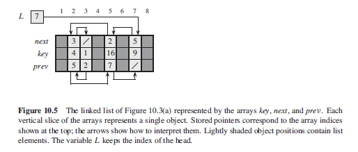
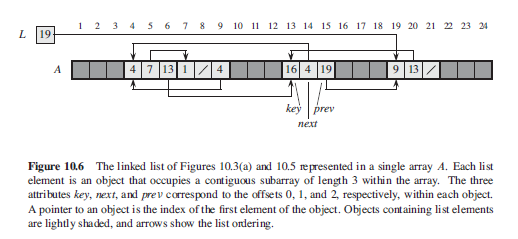

## Implementing Pointers

For languages that do not have pointers, can implement via a multiple-array representation of objects, or a single-array representation of objects.

## Multiple-Array

Can represent a collection of objects that have the same attributes by using an array to hold for each attribute i.e. key, next, and prev.



```
keys = [NIL, 4, 1, NIL, 16, NIL, 9]
next = [NIL, 3, NULL, NIL, 2, NIL, 5]
prev = [NIL, 5, 2, NIL, 7, NIL, NULL]
```

## Single-Array

In single-array, an object occupies a contiguous subarray A[j..k] whereby each attribute corresponds to an offset in the range from 0 to k-j, and the pointer is in index j:

- Offsets corresponding to key, next and prev are 0, 1, 2 respectively.
- Given a pointer i, A[i+1] returns i.next and A[i+2] returns i.prev.


