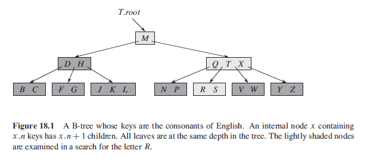
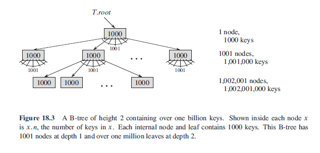

## Overview

B-trees are balanced search trees designed to work well on disk or other direct-access secondary storage devices. Many database systems use B-trees or variants of it to store information. Similar to red-black trees but each node can have many children, from a few to thousands. Has height of O(lgn) and can implement many dynamic-set operations in O(lgn).

Properties of B-trees as follows:

- If node x contains x.n keys, x has (x.n + 1) children.
- Keys in node serve as dividing points seprataing the range of keys handled by it.
- When searching for a key, we make (x.n + 1)-way decision.
- Structure of leaf nodes differ from that of internal nodes.

### Figure



## Data Structures on Secondary Storage

The need for B-tree rises in the need for lesser time in accessing the physical storage media like a hard disk. Secondary storage devices are slower with a larger capacity.

In a typical B-tree application, the amount of data handled is so large that all the data do not fit into main memory at once. B-tree algorithms copy selected pages from disk into main memory as needed, and write back onto disk the pages that have changed. Since in most systems the running time of a B-tree algorithm depends primarily on the number of DISK-READ and DISK-WRITE operations it performs, we would want each of these operations to read/write as much information as possible. Thus, a B-tree node is usually as large as a whole disk space, and this size limits the number of children a B-tree node can have.

For a large B-tree stored on a disk, will often see branching factors between 50-2000. A large branching factor dramatically reduces both the height of the tree and number of disk accesses required to find any key. As the number of keys is high, the data is read from disk in the form of blocks.

### Figure

Branching Factor of 1001 and Height of 2 can store over one billion keys.



## B-Trees

A B-tree is a self-balancing search tree. It is assumed that everything is in main memory. The node size is normally kept to the disk block size. Has the following properties:

1. Every node x has the following attributes:
   - x.n, the number of keys currently stored in node x.
   - x.n keys themselves, stored in increasing order.
   - x.leaf, a boolean value that is TRUE if x is a leaf.
2. Each internal node x contains (x.n + 1) pointers to its children.
3. Keys x.key separate the ranges of keys stored in each subtree.
4. All leaves have the same depth, which is the tree's height h.
5. Insertion only happens at leaf node.
6. Nodes have lower (t) and upper bounds on the number of keys they can contain:
   - Every node other than root must have at least (t-1) keys and t/2 children.
   - Every node may contain at most 2t-1 keys and 2t children.

Number of disk accesses required for most operations on a B-tree is proportional to the height of the B-tree.

For operations, we adopt two conventions:

- Root of B-tree is always in main memory and do not require DISK-READ.
- Need to perform DISK-WRITE on root if root node is changed.
- Any nodes that are passed as parameters must already have had DISK-READ performed.

## Searching

Instead of making a binary branching decision at each node, we make a multiway branching decision according to the number of node's children.

```
// x is the root node
// keys are stored in an array

bTreeSearch(x,k) {
    i = 1
    while i <= x.n && k > x.KEYi
        i = i + 1

    if i <= x.n && k == x.KEYi
        return (x, i)
    elseif x.leaf
        return NIL
    else
        diskRead(x.Ci)
        return bTreeSearch(x.Ci, k)
}
```

## Creating B-Tree

```
bTreeCreate(T) {
    x = new Node()
    x.leaf = True
    x.n = 0
    diskWrite(x)
    T.root = x
}
```
