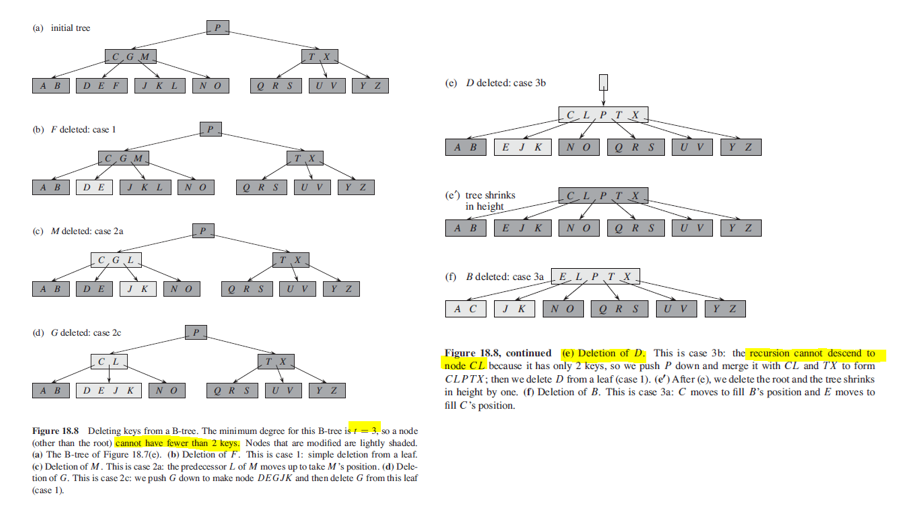

## Deletion

Need to ensure that a node doesn't get too small during deletion, except that the root is allowed to have fewer than t-1 keys.

## Cases

### If key k is in node x and x is a leaf (1)

If node x has at least t keys, delete k.

### key k is in node x and x is an internal node (2)

a) If left child of x.Ci has at least t keys, find its right-most leaf. Recursively delete right-most key (predecessor) and swap it with deleted key.

b) If left child has less than t keys (underflow), check right child of key in node x. If right child has at least t keys, swap it with left-most leaf (successor).

c) Else, merge left (y) and right child (z) by deleting right pointer (z), pushing deleted key (k) to merged node, then recursively delete k.

### Key k is not present in internal node (3)

This happens when we are performing recursion.

Find x.Ci of appropriate subtree that must contain k where x is the current node examined. If x.Ci contains t-1 keys:

a) Find x.Ci's sibling in order from left to right. If sibling has at least t keys, move predecessor/successor up to parent, and giving node x an extra key by moving the appropriate child pointer (p) into node x.

b) If siblings have t-1 keys, merge x.Ci with one sibling and move a key from x down into the new merged node to become the median key for that node. This will reduce height of tree.

## Figure

  
