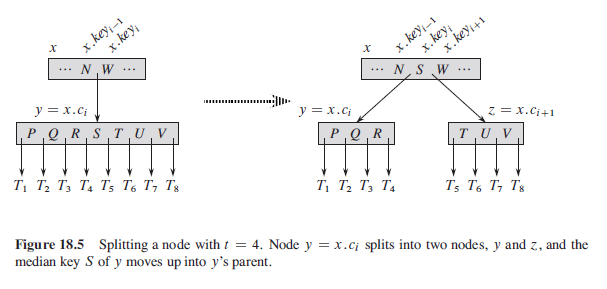
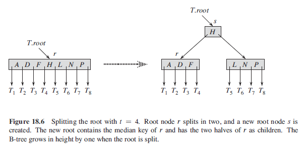
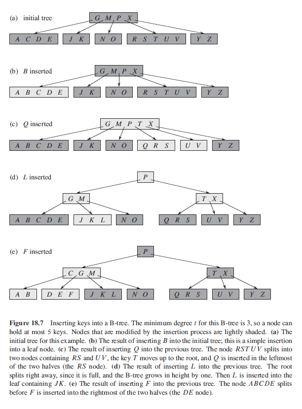

## Insertion

Instead of creating a new leaf node and inserting it, we insert the new key into an existing leaf node. Since we cannot insert a key into a leaf node that is full, we require an operation as follows:

- Split a full node (having 2t-1 keys) around its median key, y.KEYt.
- Result is two nodes having t-1 keys each.
- Median key moves up into y's parent to identify the dividing point between two new trees.
- If y's parent is full, must split it before we can insert the new key.

To insert a key, we travel down from root and search for the position where the new key belongs, while splitting each full node until we reach the leaf.

## Algorithm (Split)



```
// takes in as input a nonfull internal node x (assumed to be in main memory)
// and index i such that x.Ci (y) is a full child of x
// y will be split as it is full

bTreeSplitChild(x,i) {
    z = new Node()
    y = x.Ci
    z.leaf = y.leaf

    // total have 2t - 1 keys
    // median is removed; (2t-1-1)/2 = t-1
    z.n = t - 1

    for j=1 to t-1
        // left node
        z.KEYj = y.KEY(j+t)

    if not y.leaf
        for j = 1 to t
            z.Cj = y.C(j+t)

    // left node
    y.n = t-1

    for j = (x.n + 1) downto (i+1)
        // shift right by one
        x.C(j+1) = x.Cj

    // insert z as a child of x
    x.C(i+1) = z

    for j = x.n downto i
        // shift right by one
        x.KEY(j+1) = x.KEYj

    // move median key from y up to x
    x.KEYi = y.KEYi
    x.n = x.n + 1

    diskWrite(y)
    diskWrite(z)
    diskWrite(x)
}
```

## Algorithm (Insert)



```
bTreeInsert(T,k) {
    r = T.root
    if r.n == 2t - 1
        // if root is full, root splits a new node s becomes root
        // s will have two children
        // splitting the root is the only way to increase height of B-tree
        s = new Node()
        T.root = s
        s.leaf = False
        s.n = 0
        s.C1 = r
        bTreeSplitChild(s,1)
        bTreeInsertNonFull(s,k)
    else
        bTreeInsertNonFull(r,k)
}
```

```
bTreeInsertNonFull(x,k) {
    i = x.n
    if x.leaf
        while i >= 1 && k < x.KEYi
            // start from right and check against each key
            // if k is smaller than compared key,
            // move compared key up by one slot
            x.KEY(i+1) = x.KEYi
            i = i - 1

        x.KEY(i+1) = k
        x.n = x.n + 1
        DISK-WRITE(x)
    else
        // insert k into the appropriate leaf node
        while i >=1 && k < x.KEYi
            i = i - 1

        i = i + 1
        DISK-READ(x.Ci)

        if x.Ci.n == 2t -1
            // child is full
            bTreeSplitChild(x, i)

            if k > x.KEYi
                i = i + 1
        bTreeInsertNonFull(x.Ci, k)
}
```


