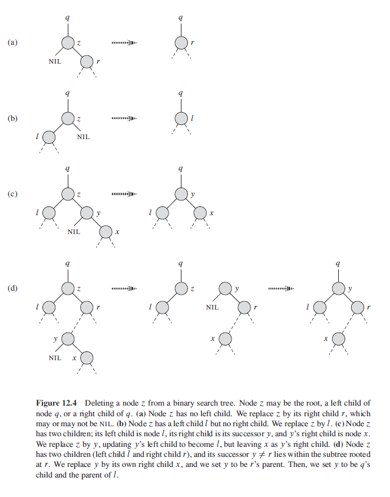

## Binary Search Trees

The search tree data structure supports many dynamic-set operations, including SEARCH, MINIMUM, MAXIMUM, PREDECSSOR, SUCCESSOR, INSERT and DELETE. BST can be used both as a dictionary and as a priority queue. Basic operations take time proportional to height of tree. Has time complexity of O(lgn).

At each node, we want the value of that node to either tell us that we have found the required item, or tell us which of its two subtrees should search for it in. By definition, a binary search tree is one that is either empty or satifies the following conditions:

- All values occurring in left subtree are smaller than that of root.
- All vlaues occurring in right subtree are larger than that of root.
- Left and right subtrees are themselves binary search trees.
- There must be no duplicate nodes.

### Balancing Binary Search Trees

In extreme cases where new items are being added in ascending order, the tree will be one with long branch off to the right, with height n >> log2n. Can rebalance binary trees from time to time using tree rotations. Typically, such rotations would need to be applied to many different sub-trees of a full tree to make it perfectly balanced.

### Insertion

When building BST, one naturally starts with root and adds further new nodes as needed. For insertion:

1. If given tree is empty, assign new value to root and leave left/right subtrees empty.
2. If is non-empty, insert a node on left if is lesser, right if greater, error if equal.

```
treeInsert(T,z) {
  y = NIL
  x = T.root

  while x != NIL
    y = x
    if z.key < x.key
      x = x.left
    else x = x.right

  // x = NIL i.e. empty child
  z.parent = y

  if y == NIL
    // tree is empty
    T.root = z
  elseif z.key < y.key
    y.left = z
  else
    y.right = z
}
```

```
insert(v,bst) {
  if ( isEmpty(bst) )
    return MakeTree(v, EmptyTree, EmptyTree)
  elseif ( v < root(bst) )
    return MakeTree(root(bst), insert(v,left(bst)), right(bst))
  elseif ( v > root(bst) )
    return MakeTree(root(bst), left(bst), insert(v,right(bst)))
  else error(`Error: violated assumption in procedure insert.')
}
```

For large database, it is more efficient to modify given tree, rather than to construct a whole new tree. Can be easily done using pointers.

### Search

When searching, have to compare the item being looked for with the root, and then keep 'pushing' the comparison down into left or right subtree depending on the result of each root comparison, until a match is found or leaf is reached:

- If tree is empty, return false.
- If value is equal to root, return true.
- If value is smaller than root, search left sub-tree.
- If value is greater than root, search right sub-tree.
- Repeat until value is equal to current node.

```
isIn(value v, tree t) {
  while ( (not isEmpty(t)) and (v != root(t)) )
    if (v < root(t) )
      t = left(t)
    else
      t = right(t)
  return ( not isEmpty(t) )
}
```

### Deletion

Overall strategy has three basic cases:

- If node in question is a leaf i.e. no subtrees, remove it.
- If only one of the node's subtrees is non-empty, 'move up' the remaining subtree.
- If node has two non-empty sub-trees, find the 'left-most' node occurring in the right sub-tree. Use this node to overwrite the one that is deleted.

Last part works as left-most node in right sub-tree is guaranteed to be bigger than all nodes in left sub-tree. For algorithm provided, other editions may swap the key of deleted node with left-most node. Downside of this approach is that the node deleted may not be the node passed in delete procedure i.e. if pointers are used. The transplant procedure guaranteees that a call to delete node z, deletes node z.

```
transplant(t, u, v) {
  // replaces one subtree as a child of its parent with another
  // replaces subtree rooted at u with subtree rooted at node v
  // node u's parent become node v's parent i.e. v becomes its child

  if u.parent == NIL
    T.root = v

  // u is either a left child or right child of its parent
  else if u == u.parent.left
    u.parent.left = v
  else
    u.parent.right = v

  if v != NIL
    v.parent = u.parent
}
```

```
treeDelete(T, z) {
  // if z has one child
  // y is either node removed from tree
  // or moved within the tree

  if z.left == NIL
    transplant(T, z, z.right)
  else if z.right == NIL
    transplant(T, z , z.left)
  else
    // z has two children
    // replace it with left-most node of right subtree
    y = treeMinimum(z.right)

    if y.parent != z
      transplant(T, y, y.right)
      y.right = z.right
      y.right.parent = y

    // swapping left-most node with deleted node
    transplant(T, z, y)
    y.left = z.left
    y.left.parent = y
}
```

### Delete Cases



### Minimum

```
treeMinimum(x){
  while x.left != NIL
    x = x.left
  return x
}
```

### Successor

```
// has time complexity of O(h)
treeSuccessor(x){
  if x.right != NIL
    // successor is leftmost node in x's right subtree
    return treeMinimum(x.right)

  y = x.parent
  while y != NIL && x == y.right
    // x is larger than parent
    // to continue traversing up until we find a node
    // that is the left child of its parent
    x = y
    y = x.parent

  return y
}
```

## Binary Trees vs Binary Search Trees

|            | Binary Tree                                                                                                                                                                | Binary Search Tree                                                                                                                                |
| ---------- | -------------------------------------------------------------------------------------------------------------------------------------------------------------------------- | ------------------------------------------------------------------------------------------------------------------------------------------------- |
| Definition | A Binary Tree is a non-linear data structure in which a node can have 0, 1 or 2 nodes. Individually, each node consists of a left pointer, right pointer and data element. | A Binary Search Tree is an organized binary tree with a structured organization of nodes. Each subtree must also be of that particular structure. |
| Structure  | There is no required organization structure of the nodes in the tree.                                                                                                      | The values of left subtree of a particular node should be lesser than that node and the right subtree values should be greater.                   |
| Operations | The operations that can be performed are deletion, insertion and traversal as it is unordered.                                                                             | As these are sorted binary trees, they are used for fast and efficient binary search, insertion and deletion.                                     |
| Types      | Complete Binary Tree, Full Binary Tree, Extended Binary Tree                                                                                                               | AVL Trees, Splay Trees, Tango Trees, T-Trees.                                                                                                     |

## Checking Binary Tree is Binary Search Tree

For checking binary trees, check if all nodes in left sub-tree are smaller than root and themselves form a binary search tree, and right sub-tree are bigger than root and themselves form a binary search tree.
