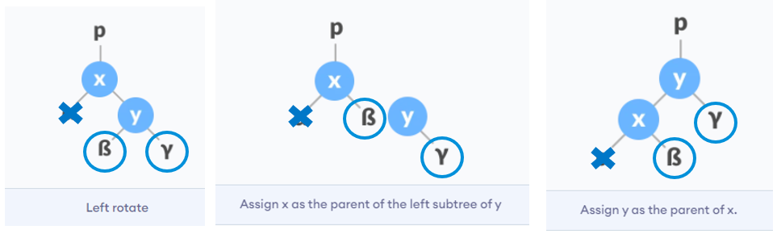
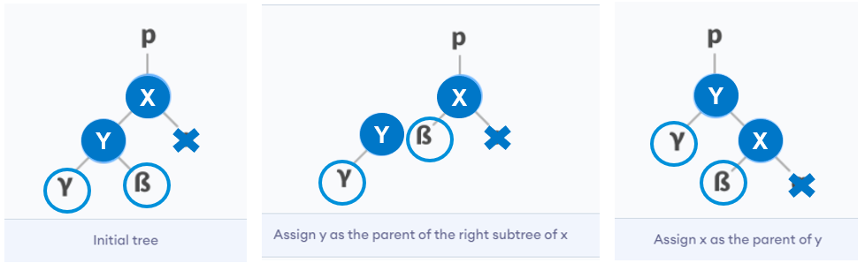
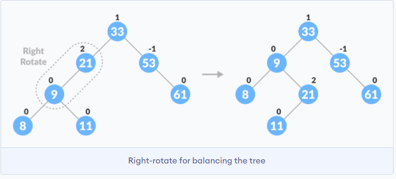

## AVL Tree

AVL tree is a self-balancing BST in which eac node maintains extra information called a balance factor whose value is either -1, 0 or +1. Balance factor is the difference between height of left subtree and right subtree of any node. Most of BST operations (search, max, min, insert, delete) take O(h) but time complexity may increase to O(n) for a skewed BST. To have an unbalanced tree, need minimum height of 2.

When performing rotations, ensure subtree of subnode of unbalanced node that is being rotated is handled. Pivot of rotations start from unbalanced node i.e. LEFT RIGHT means going down LEFT followed by RIGHT, starting from unbalanced node.

### Left Rotation with Ancestors (Single, RIGHT-RIGHT Case)

Starting from imbalance node, if there is an imbalance in right subtree of its right child.

- If right subtree (y) of unbalanced node (x) has left subtree (z), assign z as right subtree of x.
- If parent of x is NULL, make y the root of tree.
- Else if x is the left child of its parent (p), make y as the left child of p.
- Else assign y as the right child of p.
- Finally, make x the left subtree of y.

### Right Rotation with Ancestors (Single, LEFT-LEFT Case)

If there is an imbalance in left subtree of left child.

- If left subtree (y) of unbalanced node (x) has right subtree (z), assign z as left subtree of x.
- If parent of x is NULL, make y the root of tree.
- Else if x is the right child of its parent (p), make y as the right child of p.
- Else assign y as the left child of p.
- Finally, make x the right subtree of y.

### Left-Right Rotation (Double, LEFT-RIGHT Case)

If there is an imbalance in right subtree of the left child. If root is imbalanced, direction must be in the same path to added node when traversing down the tree.

### Right-Left Rotation (Double, RIGHT-LEFT case)

If there is an imbalance in left subtree of right child.

## Insertion

Rotation operations are performed on the unbalanced node. Only need to rebalance the subtree rooted with first unbalanced node:

- Let newly inserted node be w.
- Perform standard BST INSERT on w.
- Starting from w, travel up and find the first unbalanced node.
- Let z be first unbalanced node, and y be the child of z (coming from path of w).
- Rebalance the tree by performing appropriate rotations on y.

## Deleting Node

Unlike insertion, after performing rotation on unbalanced node, may need to perform rotation of ancestors of the unbalanced node.

### Perform Delete BST operation

### Update Balance Factor

### Rebalance (BF > 1)

If balanceFactor of leftChild is >= 0, do right rotation. Else, do left-right rotation.

### Rebalance (BF < -1)

If balanceFactor of rightChild is <= 0, do left rotation. Else, do right-left rotation.
