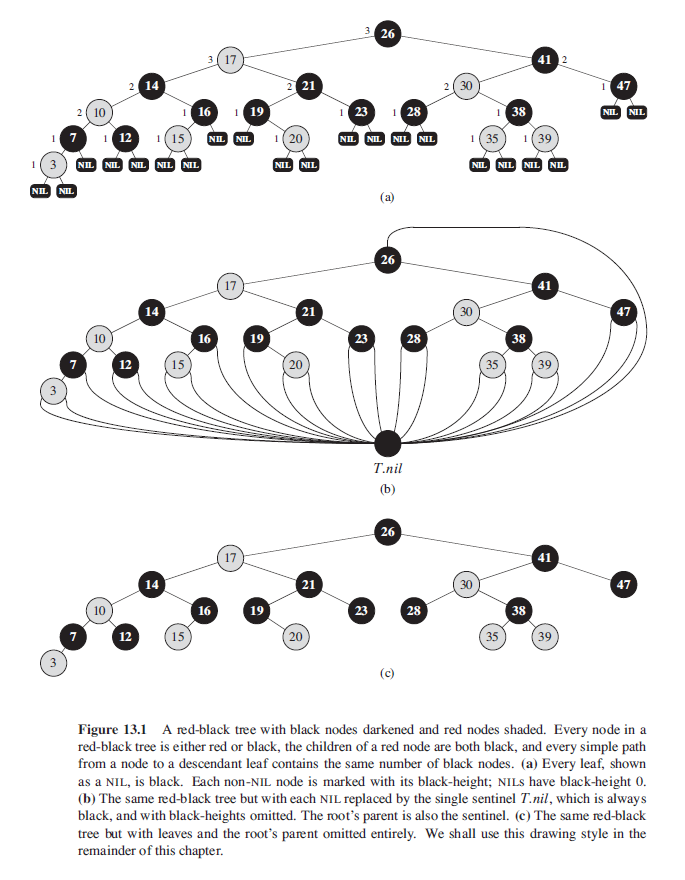
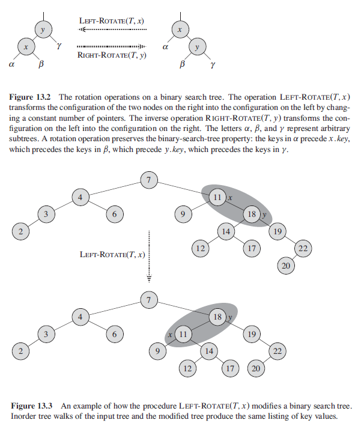
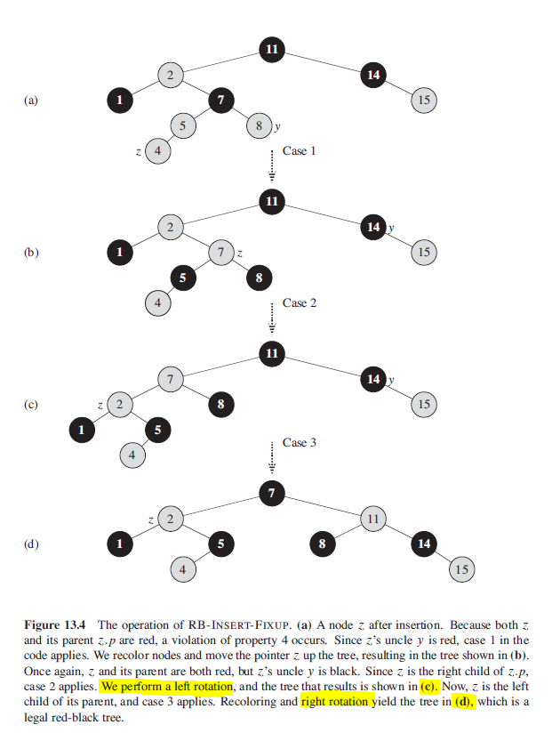
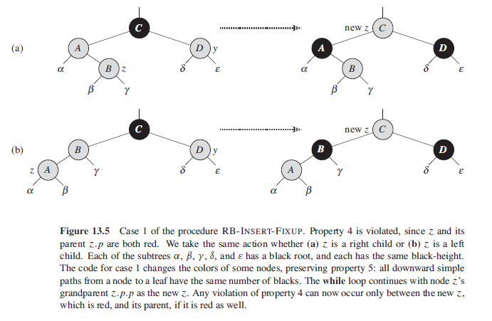
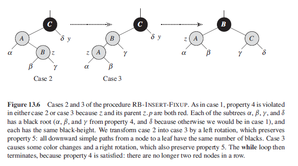
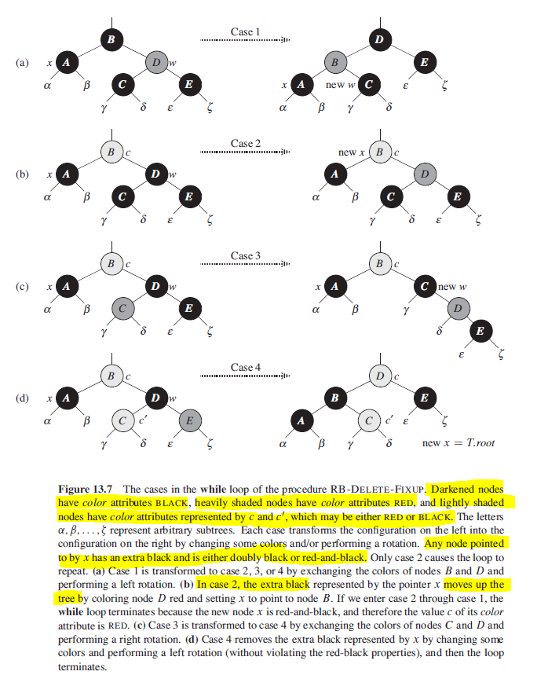

## Red-Black Trees

A red-black tree is a BST with one extra bit of storage per node: its color, which can either be red or black. Ensures that no path is more than twice as long as any other, so that the tree is approximately balanced. Has height at most 2lg(n+1). A red-black tree satisfies the following properties:

1. Every node is either red or black.
2. Root is black.
3. Every leaf (NIL) is black.
4. If a node is red, then both its children are black i.e. cannot have red child.
5. For each node, all simple paths from the node (including root) to its NIL descendants contain the same number of black nodes (inclusive of NIL).

For convenience in dealing with boundary conditions, a single sentinel is used to represent NIL. T.nil is an object with same attributes as an ordinary node that is black. Hence, can treat NIL child of a node x as an ordinary node whose parent is x. One sentinel is used to represent all NILs i.e. all leaves and root's parent. Values of attributes parent, left, right, and key are immaterial.

### Figure



## Rotations

During insertion or deletion, the result may violate red-black properties which requires changing of pointer structure through rotation.

### Left

When a left rotation is performed on node x, we assume its right child y is not T.nil and that the root's parent is T.nil. Left rotation "pivots" around the link from x to y resulting in:

- Y is the new root of subtree.
- X is Y's left child.

### Figure



### Algorithm (Pseudo)

```
leftRotate(T,x) {
    y = x.right

    // turn y's left subtree to x's right subtree
    x.right = y.left
    if y.left != T.nil
        y.left.parent = x

    if x.parent == T.nil
        T.root = y
    elseif x == x.parent.left
        x.parent.left = y
    else
        x.parent.right = y

    y.left = x
    x.parent = y

}
```

## Insert

When a node is inserted, it will always be inserted as a RED node. This is because it does not violate the depth property 5. For balancing, recoloring is first performed. The color of the uncle is checked to decide the appropriate case. If properties are still violated after recoloring, rotation is performed. The main property that is violated is two consecutive reds.

```
redBlackInsert(T, z) {
    z.left = T.nil
    z.right = T.nil
    z.color = RED
    treeInsert(T,z)
    redBlackInsertFixup(T, z)
}
```

```
redBlackInsertFixup(T,z){
    while z.parent.color == RED
        if z.parent == z.parent.parent.left
            y = z.parent.parent.right   // uncle
            if y.color == red
                // CASE 1
                // change parent and uncle to BLACK
                // change grandparent to RED
                z.parent.color = BLACK
                y.color = BLACK
                z.parent.parent.color = RED

                // check parent of z's grandparent
                z = z.parent.parent

            elseif z == z.parent.right
                // CASE 2 (LEFT-RIGHT)
                // uncle is BLACK and not RED
                // can perform 4 different rotations
                z = z.parent
                leftRotate(T,z)

                // CASE 3
                z.parent.color = BLACK
                z.parent.parent.color = RED
                rightRotate(T,z)
        else
            // same as "then" clause with
            // right and left exchanged

    T.root.color = BLACK
}
```

### Figure







## Deletion

The color of the sibling is checked to decide the appropriate case. The main property violated is change of black height in subtrees as deletion of black node may reduce height in one root to leaf path. If y is RED, red-black properties will still hold when y is removed or moved:

1. No black-heights in tree have changed.
2. No red nodes have been made adjacent.
3. y could not have been the root if it was red, hence root remains black.

```
redBlackTransplant(T,u,v){
    if u.parent == T.nil
        T.root = v
    elseif u == u.parent.left
        u.parent.left = v
    else
        u.parent.right = v
    v.parent = u.parent
}
```

```
redBlackDelete(T,z) {
    // z is node deleted
    // y is the node that succeeds z
    // x is the node that moves into y's original position

    y = z
    yOriginalColor = y.color

    if z.left == T.nil
        // z has RIGHT child only
        x = z.right
        redBlackTransplant(T, z, z.right)

    elseif z.right == T.nil
        // z has LEFT child only
        x = z.left
        redBlackTransplant(T, z, z.left)

    else
        // z has two children
        y = treeMinimum(z.right)
        yOriginalColor = y.color
        x = y.right

        if y.parent == z
            // z's right is a node without left subtree
            x.parent = y
        else
            redBlackTransplant(T, y, y.right)
            y.right = z.right
            y.right.parent = y
            redBlackTransplant(T, z, y)
            y.left = z.left
            y.left.parent = y
            y.color = z.color

    if yOriginalColor == BLACK
        // if BLACK node gets deleted/moved
        // it violates black-depth property
        // if BLACK node gets replaced by BLACK child, child becomes doubly-black
        // else becomes red-and-black
        redBlackDeleteFixup(T,x)
}
```

```
redBlackDeleteFixup(T,x){
    // x always points to a nonroot doubly black node inside while loop
    // sibling w can never be T.nil
    // otherwise property 5 is violated
    // violation is corrected by giving x an extra BLACK
    // red-black or doubly-black does not refer to its color attribute
    // if x is red-black, color x as BLACK
    // if x is doubly-black, extra BLACK is moved up the tree

    while x != T.root && x.color == BLACK
        if x == x.parent.left
            w = x.parent.right // sibling
            if w.color == RED
                // CASE 1
                w.color == BLACK
                x.parent.color = RED
                leftRotate(T,x.parent)
                w = x.parent.right

            // w.color is BLACK
            if w.left.color == BLACK && w.right.color == BLACK
                // CASE 2
                // both w's children are BLACK
                w.color = RED
                x = x.parent

            else if w.right.color == BLACK
                // CASE 3
                w.left.color = BLACK
                w.color = RED
                rightRotate(T,w)
                w = x.parent.right

                // CASE 4
                w.color = x.parent.color
                x.parent.color = BLACK
                w.right.color = BLACK
                leftRotate(T,x.parent)
                x = T.root

            else
                // same as then cause with right and left exchanged

    // x is now red-and-black node, and we just color x to BLACK
    // if x points to root, we simply "remove" the extra black
    x.color = BLACK
}
```

### Figure


