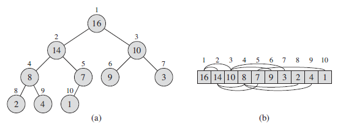
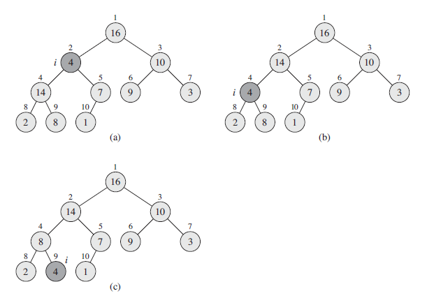
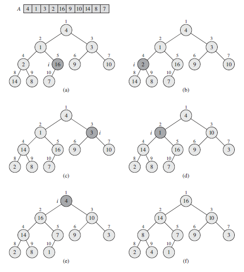

## Heap Trees

Binary trees can be stored with the help of pointer-like structures, in which each item contains references to its children. For complete binary trees, there is a useful array based alternative. A Heap is a special tree-based data structure in which the tree is a **complete binary tree**.

Heaps are binary trees for which every parent node has a value less than or equal to any of its children (**min-heap**) i.e. heap[k] <= heap[2*k+1] and heap[k] <= heap[2*k+2] for all k. Smallest element is always at the root, heap[0].

For **max-heap**, key present at root node must be maximum among all keys present in its children; same property must be recursively true for all sub-trees.

```
PARENT(i)       Returns i/2
LEFT(i)         Returns 2i
RIGHT(i)        Returns 2i+1
```



### Maintaining Heap Property

Heapify is the process of creating a heap data structure from a binary tree. Can be used to create Min-Heap or Max-Heap. Rearranging an array of items into a heap tree form can be done more efficiently using "bubble down". Heapify assumes that the binary trees rooted at LEFT and RIGHT are max-heaps, but that value A[i] might be smaller than its children and hence, violate max-heap property. Value will be floated/bubbled down. Has time complexity of O(h). Process as follows:

1. Start from index of non-leaf node (maximum is n/2).
2. Set currentElement i as largest.
3. Index of left child is given by (2i) and right child is given by (2i+1).
4. If leftChild or rightChild is greater than currentElement, set it as largest.
5. Swap largest with currentElement.
6. Repeat steps for currentElement until subtrees are heapified.



```
// i refers to index
// at each step, the largest of elements A[i], A[LEFT(i)] and A[RIGHT(i)]
// are determined
// if A[i] is largest, then subtree rooted at node i is already a max-heap

maxHeapify(A, i) {
    l = LEFT(i)
    r = RIGHT(i)

    if (l <= A.heap-size && A(l) > A[i])
        largest = l
    else
        largest = i

    if (r <= A.heap-size && A[r] > A[largest])
        largest = r

    if largest !== i
        // one of two children is largest
        // largest element gets bubbled up to A[i]
        // A[i] gets bubbled down and maxHeap is called recursively
        exchange A[i] with A[largest]
        maxHeapify(A, largest)
}
```

### Building a Heap

Can use maxHeapify in bottom-up manner to convert an array A[1..n] into max-heap. All elements in subarray A[([n/2]+1)..n] are all leaves of the tree. Has time complexity of O(n).



```
buildMaxHeap(A) {
    A.heapSize = A.length
    for (i=A.length/2; i > 0; i--)
        maxHeapify(A,i)
}

// loop invariant: at the start of each iteration, each node i+1, i+2, ..., n is the root of a max-heap
```

### Storing Binary Trees as Arrays

- Not efficient if tree is not complete as it involves reserving space in array for every possible node in tree.
- Keep binary search tree balanced is difficult.
- Node insertion and deletion requires shifting large portions of array.

### Binary Search Trees vs Binary Heap Trees

- BST is an ordered data structure while Heap Trees are not.
- Biggest number occurs at root for Heap Trees rather than at right-most node.
- Subtrees connected to a parent node play different roles and are interchangeable in Heap Trees.

### Operations

In order to develop algorithms using an array representation, need to allocate memory to keep track of largest position that has been filled so far i.e. number of nodes. Inserting requires "bubbling up" the new element into a valid position by comparing its priority with that of its parent; if it has higher priority, it is exchanged with parent. Deleting requires "bubbling down" of parent node. Both insertion and deletion takes O(log2n) steps which is equivalent to height of tree.

```
int MAX = 100       // Maximum number of nodes allowed
int heap[MAX+1]     // Stores priority values of nodes of heap tree
int n = 0           // Largest position that has been filled so far
```

```
insert(int p, array heap, int n)
delete(int i, array heap, int n)
int root(array heap, int n)
boolean heapEmpty(array heap, int n)
```

```
bubbleDown(int i, array heap, int n) {
    if ( left(i) > n )          // no children
        return
    elseif ( right(i) > n )     // only left child
        if ( heap[i] < heap[left(i)] )
            swap heap[i] and heap[left(i)]
        else // two children
    if ( heap[left(i)] > heap[right(i)] and heap[i] < heap[left(i)] ) {
        swap heap[i] and heap[left(i)]
        bubbleDown(left(i),heap,n)
    }
    elseif ( heap[i] < heap[right(i)] ) {
        swap heap[i] and heap[right(i)]
        bubbleDown(right(i),heap,n)
        }
    }
}
```

### Time Complexities Comparison

| Heap Type | Insert   | Delete   | Merge    | Heapify | Up Priority |
| --------- | -------- | -------- | -------- | ------- | ----------- |
| Binary    | O(log2n) | O(log2n) | O(n)     | O(n)    | O(log2n)    |
| Binomial  | O(1)     | O(log2n) | O(log2n) | O(n)    | O(log2n)    |
| Fibonacci | O(1)     | O(log2n) | O(1)     | O(n)    | O(1)        |
