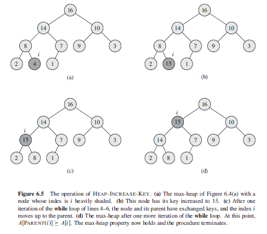

## Priority Queues

A priority queue is a data structure for maintaining a set S of elements, each with an associated value called a **key**. Generally, the value of an element is considered for assigning the priority i.e. highest value is assigned with highest priority and vice versa.

Comes in two forms: max-priority and min-priority queues which are in turn based on max/min heaps. Examples of applications include scheduling of jobs (max) and event-driven simulator in order of time of occurrence (min).

A priority queue is an extension of the queue with the following properties:

- Every item has a priority associated with it.
- An element with high priority is dequeued before an element with low priority.
- If two elements have the same priority, they are served according to their order in the queue.

```
// MAX PRIORITY

INSERT(S,x)             Inserts an element into set S
MAXIMUM(S)              Returns element of S with largest key
EXTRACT-MAX(S)          Removes and returns the element S with largest key
INCREASE-KEY(S,x,k)     Increases value of element x's key to new value k whereby k >= x
```

```
// MIN PRIORITY

INSERT(S,x)             Inserts an element into set S
MINIMUM(S)              Returns element of S with smallest key
EXTRACT-MIN(S)          Removes and returns the element S with smallest key
DECREASE-KEY(S,x,k)     Decreases value of element x's key to new value k whereby k <= x
```

### Implementing Priority Queues using Binary Heap Trees

When a heap is used to implement priority-queue, often need to store a **handle** to the corresponding application object in each heap element. The handle would typically be an array index. Updating the heap would also require updating handle.

### Operations (Max-Priority)



```
MAXIMUM(A) {
  return A[1]
}

EXTRACT-MAX(A) {
  if A.heapSize < 1
    error "heap underflow"
  max = A[1]
  // swap last element with first element
  A[1] = A[A.heapSize]
  A.heapSize = A.heapSize - 1
  maxHeapify(A, 1)
  return max
}

INCREASE-KEY(A, i, key) {
  if key < A[i]
    error "new key is smaller than current key"
  A[i] = key
  while i > 1 && A[PARENT(i)] < A[i]
    exchange A[i] with A[PARENT(i)]
    i = PARENT(i)
}

INSERT(A, key) {
  A.heapSize ++
  // adds new leaf to tree whose key is -INFINITY
  A[A.heapSize] = -INFINITY
  INCREASE-KEY(A, A.heapSize, key)
}
```

While most queues in every-day life operate on first come, first served basis, it is sometimes important to be able to assign a priority to items in queue and serving highest priority first i.e. hopsital casualty department. Queues can be implemented efficiently by **binary heap trees**:

- Node labels (previously search keys) become numbers representing priority of each item.
- Insertion/deletion becomes efficient (one element) without having to keep whole tree sorted.
- Highest priority item will always be found at root of tree.

A binary heap tree is a complete binary tree that satisfies the following conditions:

- Is an empty tree.
- Priority of root is higher than/equal to that of its children.
- Priority of every node is higher than/equal to that of all its descendants.
- Left and right subtrees of root are heap trees.
