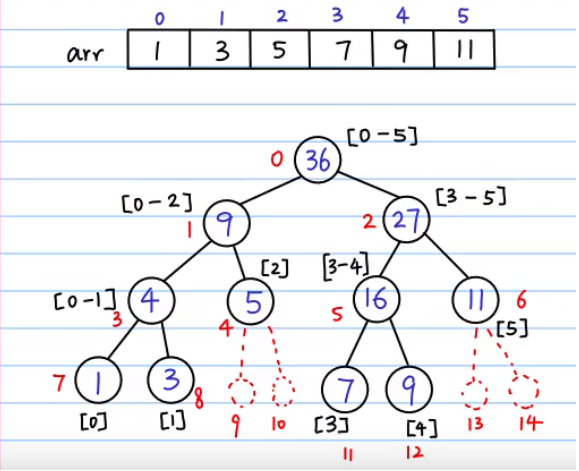

## Segment Tree

Segment tree is a very flexible data structure that can be used to solve numerous range query problems including finding min, max, sum, greatest common divisor, least common denominator in an array in logarithmic time.

The segment tree for an array is a binary tree in which each node contains aggregate information (min, max, sum, etc.) for a subrange[i...j] of the array; left child will hold information for range [i, (i+j)/2] and right child for range [(i+j)/2+1, j].



Segment tree can be broken down to three steps:

1. Pre-processing which builds the segment tree from a given array.
2. Update the segment tree when an element is modified.
3. Calculate the range query using the segment tree.

### Building Segment Tree

Can be build using a binary tree or an array. For array implementation, if the element at index i is not a leaf, its left and right child are stored at index 2i and 2i+1 respectively. Bottom-up approach.

```py
nums = [1,4,7,8]
tree = [0] * (len(nums) * 2)

def build(arr):
    n = len(arr)

    # inserting leaf nodes
    for i in range(n):
        tree[n+i] = arr[i]

    # inserting parents
    for i in range(n-1, 0, -1):
        tree[i] = tree[i*2] + tree[i*2 + 1]
```

### Updating Segment Tree

Need rebuild segment tree as there are tree nodes which contain the sum of the modified element. Bottom-up approach.

```py
def update(idx, val):
    idx += n
    tree[idx] = val

    while idx > 0:
        left = idx
        right = idx

        if idx % 2 == 0:
            right = idx + 1
        else:
            left = idx - 1

        tree[idx // 2] = tree[left] + tree[right]
        idx /= 2
```

### Get Query Range

```py
def query(l, r):
    sum = 0

    # loop to find the sum in the range
    l += n
    r += n

    while l <= r:
        # check if l is right child of parent P
        if l % 2 == 1:
            # do not need parent P sum as it is out of bounds
            sum += tree[l]
            # set left to the right of P on upper level
            l += 1

        # check if r is left child or parent P
        if r % 2 == 0:
            # do not need parent P sum also
            sum += tree[r]
            # set right to left of P on upper level
            r -= 1

        l /= 2
        r /= 2

    return sum
```
