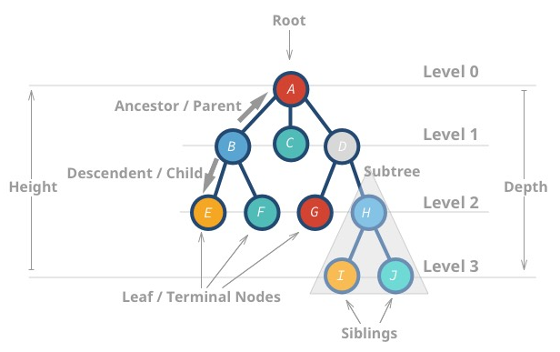

## Trees

In Computer Science, tree is a very general and powerful non-linear data structure that resembles a real tree. Consists of an ordered set of linked nodes in a connected graph, in which each node has at most one parent node, and zero or more children nodes which a specific order.

A tree can be defined as either an empty tree, or a node with a list of successor trees. Nodes are usually labelled with a data item i.e. number/search key. There is always a unique "top-level" node known as the root. Given a node, every node on the next level "down" is connected to the given node via branch.

Path is a sequence of connected edges from one node to another. For every node, there is a unique path connecting it with the root. Depth/level of a node is given by length of its path i.e. root has level 0, children have level 1, and etc. Length of tree is also called height of tree.

Like most data structures, need primitive operators (constructors, seleectors, conditions) to build and manipulate trees.



## Quad Trees

For a quadtree, each leaf-node is labelled by a value and each non-leaf mode has exactly four children. Used most often to partition two-dimensional space i.e. pixelated image by recursively dividing it into four quadrants. A quadtree by definition is either:

- Root node with a value, or
- Root node without a value and four quad tree children, lu, ll, ru, rl.
- Can be tested with isValue(qt), which returns true if qt is single node.

### Selectors

```
lu      Returns left-upper quad-tree
ru      Returns right-upper quad-tree
ll      Returns left-lower quad-tree
rl      Returns right-lower quad-tree
```

```
rotate(qt) {
    if (isValue(qt)) return qt
    else return makeQT(
        rotate(rl(qt)),
        rotate(ll(qt)),
        rotate(ru(qt)),
        rotate(lu(qt)),
    )
}
```
