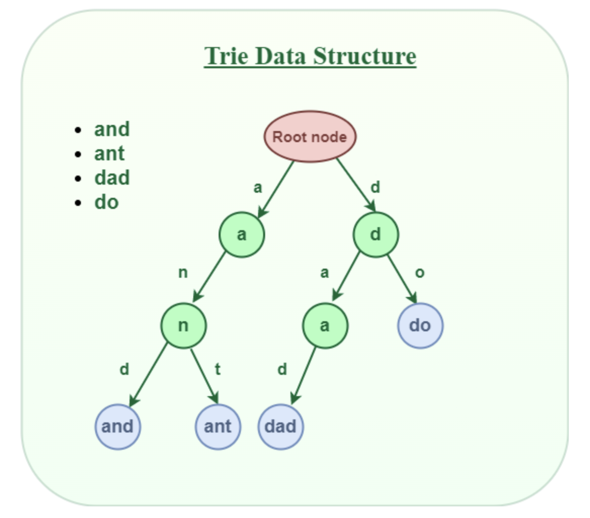

## Trie

Trie is a type of k-ary search tree used for storing and searching a specific key from a set. It is a multiway tree data structure used for storing strings over an alphabet. It is used to store a large amount of strings.

The idea is that all strings sharing common prefix should come from a common node. Tries are used in spell checking programs.

If we store keys in a BST, a well-balanced BST will ned O(M \* logN), where M is the maximum string length and N is the number of keys in the tree. With Trie, the key can be searched in **O(M)** time.



### Strengths

- If you are storing many words that start with similar patterns, Tries may reduce the overall storage cost and hence, can be space-efficient
- Tries can quickly answer queries about words with shared prefixes i.e. how many words start with "choco"

### Structure

Every node of Trie consists of multiple branches. Each branch represents a possible character of keys. Mark the last node of every key as the end of the word node with isEndOfWord field.

```java
class TrieNode {
    boolean isWord;
    Map<Character, TrieNode> children;
    TrieNode() {
        this.children = new HashMap<>();
    }
}
```
