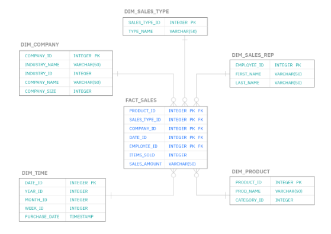

### Background

When constructing backend applications, need to consider how frontend communicates with backend i.e. the construction and design of database. The relationship the data forms will lead to the construction of database schema.

### Schema

A database schema defines how data is organized within a relational database, and is inclusive of logical constraints such as table names, fields, data types, and the relationships between these entities. Schemas commonly use visual representations to communicate the architecture of the database.

Schema in SQL is a collection of database objects associated with a database including tables, fields, views, triggers, relationships, stored procedures, indexes, etc. It describes both the organization of data and relationships between tables in a database i.e. represents the framework and arrangement of the contents of an organization’s data. Essentially a blueprint of how the database is constructed.

Schema always belongs to one database, whereas a database may have multiple schemas. The user that owns the schema is known as schema owner. Useful mechanism to segregate database objects for different applications, access rights, and managing the security administration of databases.

Database schema includes:

- All important or relevant data.
- Consistent formatting for all data entries.
- Unique keys for all entries and database objects.
- Each column in a table has a name and data type.

Schemas are important for designing database management systems (DBMS) or relational database management sysytems (RDBMS). Examples of DBMS include MySQL, Oracle, PostgreSQL, etc.



### Built-in Schemas

```sql
dbo   -- default schema for newly created database
guest
sys
INFORMATION_SCHEMA
```

### Creating Schema

```sql
CREATE SCHEMA schema_name [AUTHORIZATION owner_name]
```

### Creating Objects

```sql
-- General syntax
CREATE TABLE schemaname.tablename(values... );

CREATE TABLE geeks_sch.Geektab(
G_id INT PRIMARY KEY IDENTITY,
Name VARCHAR(200),
DOJ DATETIME2 NOT NULL
);
```

### Query All Schemas

```sql
SELECT
    s.name AS schema_name,
    u.name AS schema_owner
FROM
    sys.schemas s
INNER JOIN sys.sysusers u ON u.uid = s.principal_id
ORDER BY
    s.name;
```
