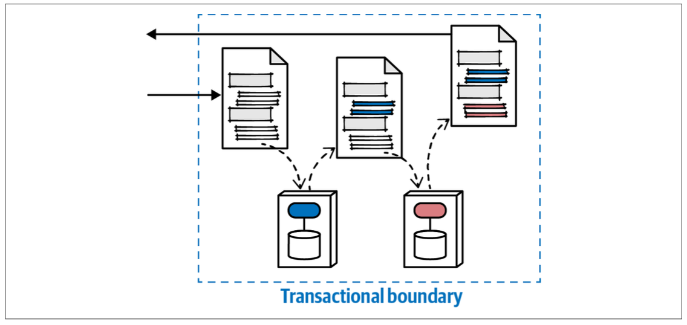

## Stamp coupling

Stamp coupling describes passing a large data structure between services, but each service interacts with only a small part of the data structure. It is often an accidental anti-pattern, where an architect has **over-specified the details in a contract** that aren’t needed or accidentally consumes far too much bandwidth for mundane calls.

The negative side effect of too much coupling in contracts is brittleness.

Stamp coupling can create problems when overused, including issues caused by coupling too tightly to bandwidth.

## Stamp coupling for workflow management

When implementing saga pattern, for a complex workflow that requires scalability (choreography), architects can use stamp coupling to manage the workflow state between services, passing both domain knowledge and workflow state as part of the contract.

An architect designs the contract to include workflow information: status of the workflow, transactional state, and so on. As each domain service accepts the contract, it updates its portion of the contract and state for the workflow, then passes it along. At the end of the workflow, the receiver can query the contract to determine success or failure, along with status and information such as error messages. If the system needs to implement transactional consistency throughout, then domain services should rebroadcast the contract to previously visited services to restore atomic consistency.

Using stamp coupling to manage workflow does create higher coupling between services than nominal, but the semantic coupling must go somewhere.
