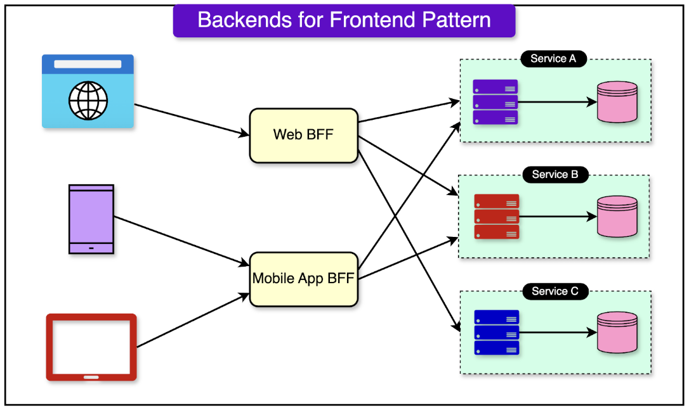
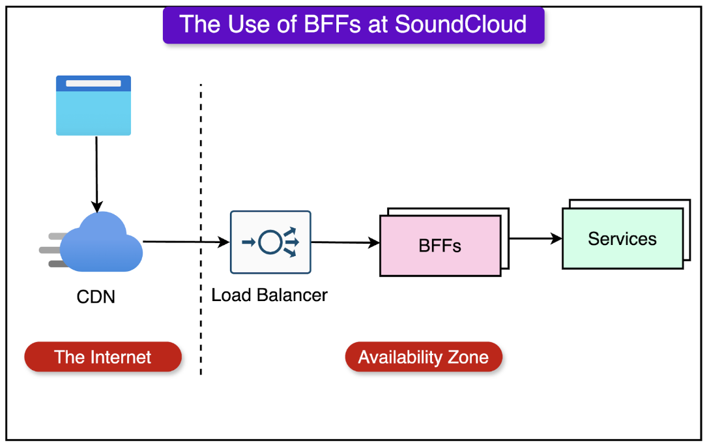
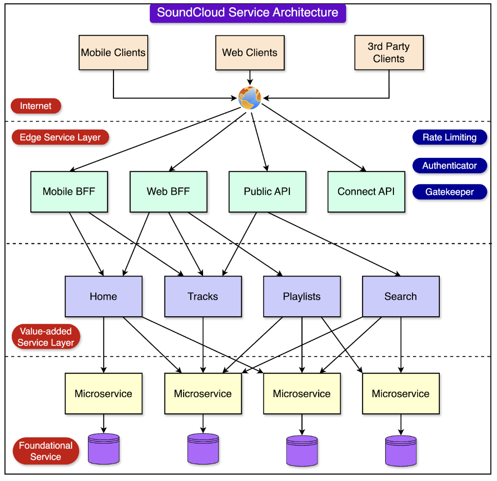

## Backends for Frontends (BFF)

BFF is a dedicated API gateway for each device or interface type interacting with your application. This pattern is useful when you want to avoid customizing a single backend for multiple interfaces i.e. avoiding monolithic API approach.

BFFs can also handle multiple functionalities including:

- Rate limiting
- Authentication
- Header sanitization
- Cache-control

### Context and Problem

An application may initially be targeted at desktop web UI where typically the backend is created in parallel to provide the features needed for that UI. As the application's user base grows, a mobile application is developed that must interact with the same backend.

However, the capabilities of a mobile device differ significantly from a desktop browser i.e. screen size, performance, display limitations, etc. These differences result in competing requirements for the backend, and require regular and significant changes to serve both UI interfaces. Conflicting update requirements, the need to keep the service working for both frontends, can result in spending a lot of effort on a single deployable resource.

### Solution

Create one backend per user interface. Fine-tune the behavior and performance of each backend to best match the needs of the frontend environment, without worrying about affecting other frontend experiences.

### When to use BFF

Use this pattern when:

- A shared or general purpose backend service must be maintained with significant development overhead
- You want to optimize the backend for requirements of specific client interfaces
- Customizations are made to a general-purpose backend to accommodate multiple interfaces

May not be suitable when:

- Interfaces make the same or similar requests to the backend
- Only one interface is used to interact with the backend

## Benefits

### Autonomy

Autonomy is perhaps the biggest value addition in using a BFF. Separate APIs per client type means that we can optimize the API for whatever is most convenient for a particular client type.

## Resilience and lower risk

BFFs also reduce the overall risk of the application going down.

While a bad deployment might bring down an entire BFF in an availability zone, it doesn’t bring down the entire platform, which was a possibility with the monolithic API approach.

## High development speed

Autonomy and resilience work together to improve confidence, resulting in a higher development speed for new features.

## Downsides

### Complexity

When the microservices powering the BFFs are very small, performing only CRUD operations with no business logic, the feature integration ends up in the BFF layer. In other words, the entire business logic goes into the BFF layer.

Moreover, there is a prevalent idea that the BFF is just an extension of the client and should be treated as the backend side of the client.

While the sentiment is justified due to the naming, it results in developers pushing complex client-side logic to BFF. For example, pushing functionalities like pagination to the server.

### Duplication of code

While centralized API gateways also have a problem when business logic ends up getting migrated to the gateway, BFFs also suffer from duplication.

Business logic is duplicated across multiple BFFs. Over time, this duplication can diverge, resulting in inconsistent implementations that drift apart as more development happens.

### Proliferation of BFFs

While BFFs provide autonomy, they also introduce operational overhead. If the team starts to create BFFs for every minor use case, suddenly there is a lot of maintenance overhead.

## Issues and considerations

- Consider how many backends to deploy
- Code duplication across services is highly likely when implementing this pattern
- Frontend-focused backend services should only contain client-specific logic and behavior; general business logic should be managed elsewhere

## Value-Added Services (VAS)

The BFF implementations can become problematic over time due to multiple reasons:

- Increased complexity
- Increased duplicate of code
- Divergent authorization and business logic across BFFs

This divergence was especially dangerous because the maintenance and synchronicity of the authorization logic are critical for a secure system.

Services in this layer consume data from other services and process them in some way to build better experiences for the user.

VAS is built on the concept of DDD using Domain, Entity, Value Objects and Aggregates.

The VAS sit between the BFFs and downstream foundational services, and synthesize the aggregates for the BFF. Their main responsibility is to serve core aggregates.

### Challenges

- With more features, VAS may suffer from a big fanout of calls to multiple services
- BFFs often have different needs based on their application for mobile and web; it does not make sense to fetch the entire aggregate where that feature may not be needed in mobile; this can be resolved by implementing partial response feature in which API consumers can specify which part of the response they will consume using a **FieldMask** in the request
