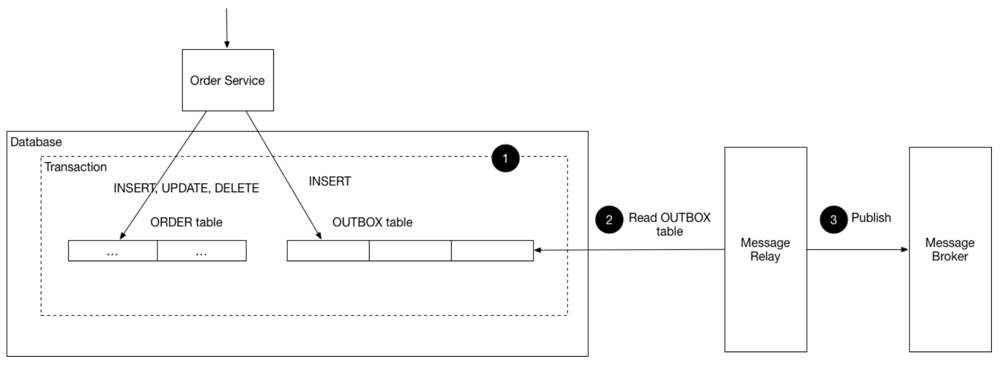

## Context

A service command typically needs to create/update/delete aggregates in the database and send messages/events to a message broker. For example, a service that participates in a saga needs to update business entities and send messages/events. Similarly, a service that publishes a domain event must update an aggregate and publish an event.

The command must **atomically** update the database and send messages in order to ensure data consistency and reliability (**dual writes** to keep a consistent state). However, it is not viable to use a traditional distributed transaction (2PC) that spans the database and the message broker as the database and/or the message broker might not support 2PC. Even if they do, it’s often undesirable to couple the service to both the database and the message broker.

However, without 2PC:

- Sending a message in the middle of a transaction is not reliable, as there is no guarantee that the transaction will commit
- Sending a message after committing the transaction is also not reliable, as there is no guarantee that it won’t crash before sending the message

In addition, messages must be sent to the message broker in the order they were sent by the service:

- An aggregate is updated by transactions Tx1 and Tx2 in order
- Tx1 publishes E1, and Tx2 publishes E2
- E1 must precede before E2

## Outbox pattern

The solution is for the service that sends the message to first store the message in the database (relational) as part of the transaction that updates the business entities. A separate process then sends the messages to the message broker.

When your API publishes event messages, it doesn’t directly send them. Instead, the messages are persisted in a database table. After that, A job then publish the events to a message broker system in predefined time intervals.

The Outbox pattern provides to publish events reliably. Domain events are not written directly to an event bus. Instead, it is persisted in a table in the 'outbox' role of the service that stores the event in its own database.

However, the critical point here is that the transaction performed before the event and the event written to the outbox table are part of the same transaction.

### Why use this pattern?

If you are working with critical data that need to be consistent and accurate to catch all requests, it is good to use Outbox pattern.
