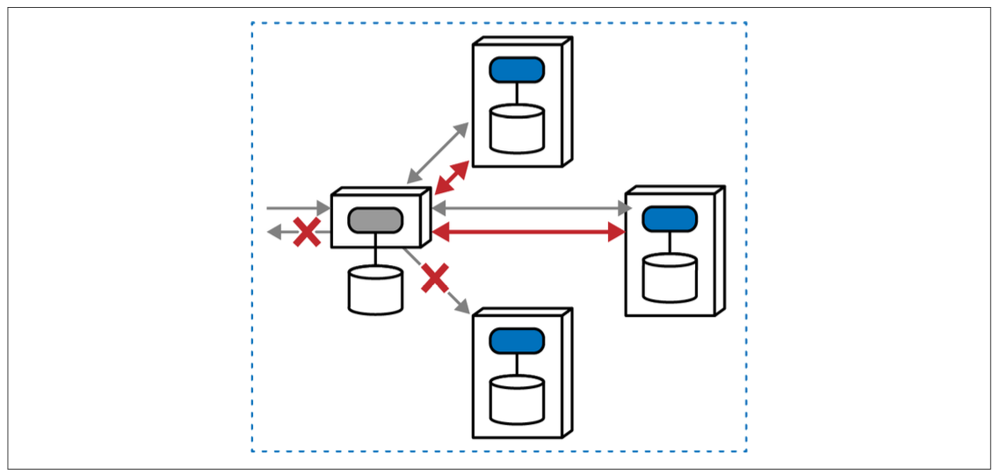
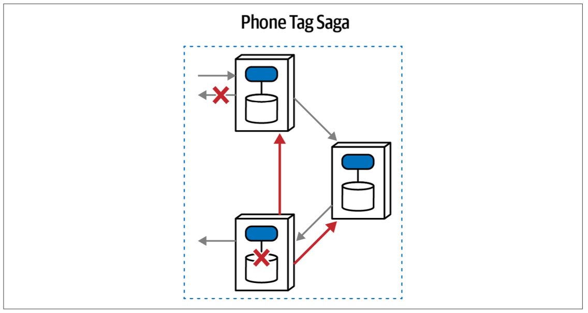
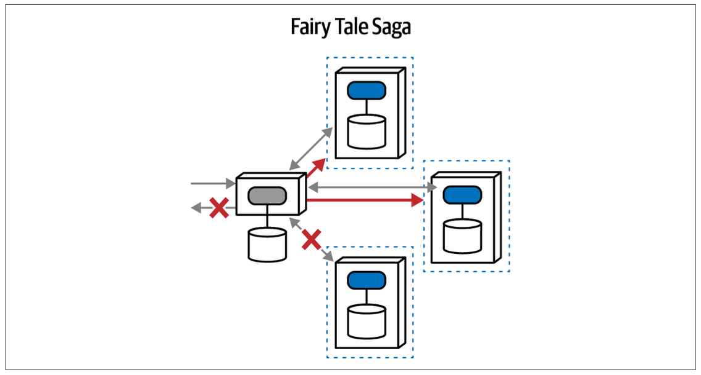
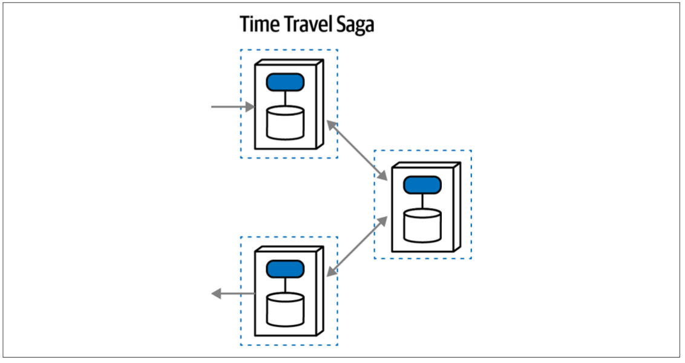
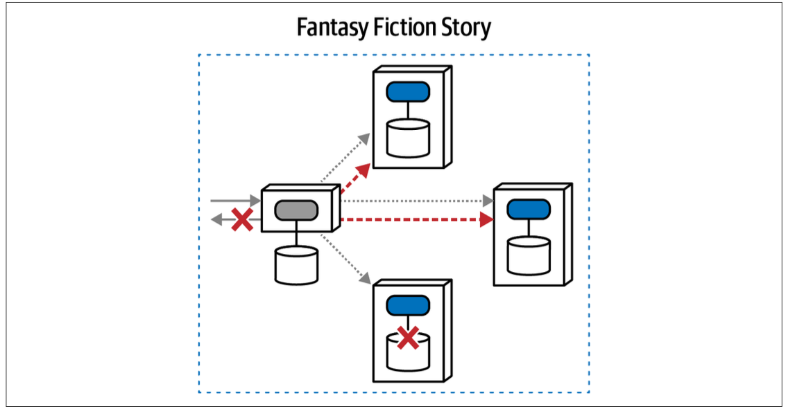
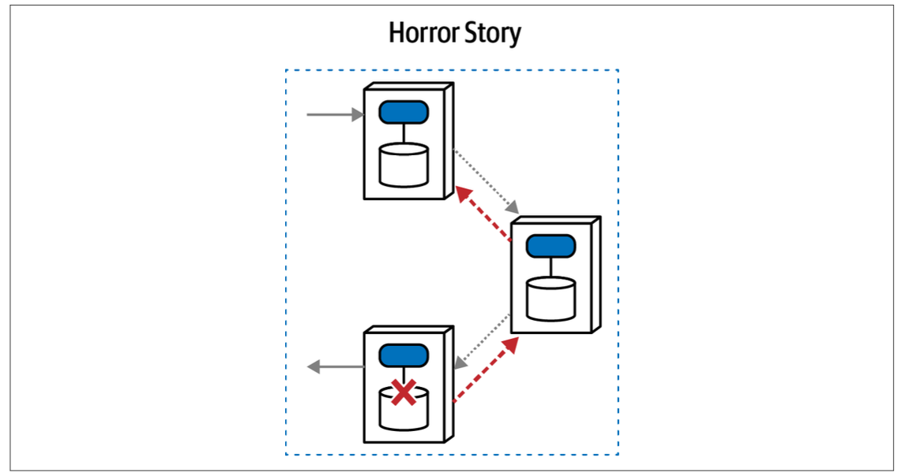
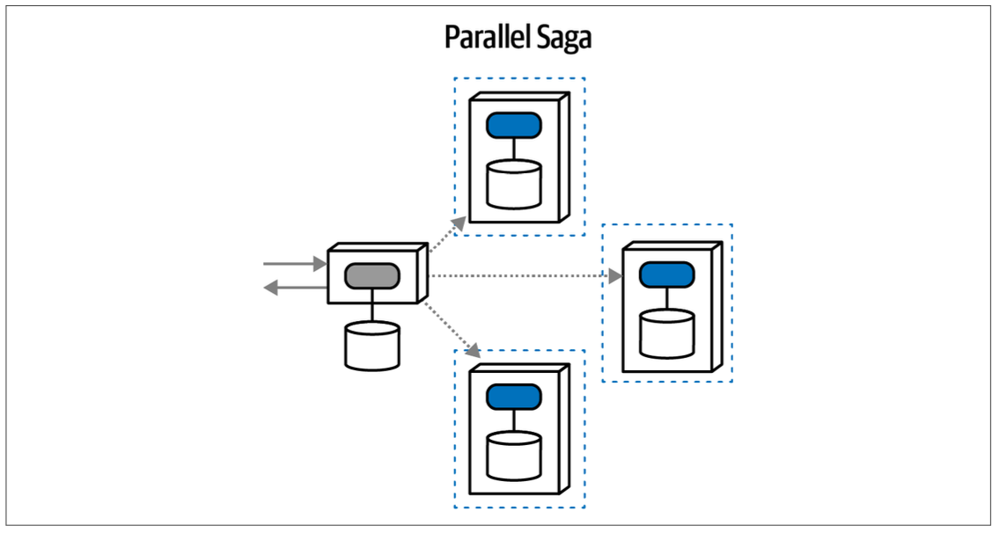
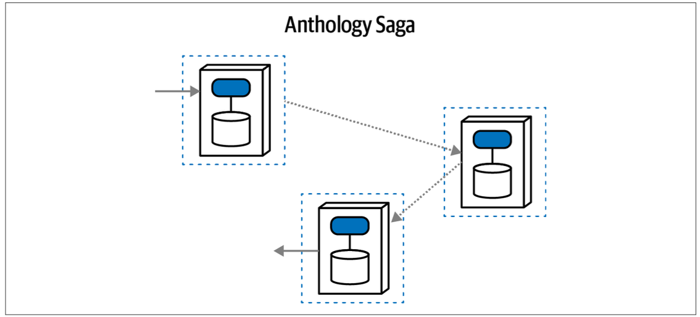

## Transactional saga patterns

<table>
<tr>
<th>Pattern</th>
<th>Communication</th>
<th>Consistency</th>
<th>Coordination</th>
<th>Coupling</th>
<th>Complexity</th>
<th>Responsiveness</th>
<th>Elasticity</th>
</tr>

<tr>
<td>Epic Saga</td>
<td>Synchronous</td>
<td>Atomic</td>
<td>Orchestrated</td>
<td>Very high</td>
<td>Low</td>
<td>Low</td>
<td>Very low</td>
</tr>

<tr>
<td>Phone Tag Saga</td>
<td>Synchronous</td>
<td>Atomic</td>
<td>Choreographed</td>
<td>High</td>
<td>High</td>
<td>Low</td>
<td>Low</td>
</tr>

<tr>
<td>Fairy Tale Saga</td>
<td>Synchronous</td>
<td>Eventual</td>
<td>Orchestrated</td>
<td>High</td>
<td>Very low</td>
<td>Medium</td>
<td>High</td>
</tr>

<tr>
<td>Time Travel Saga</td>
<td>Synchronous</td>
<td>Eventual</td>
<td>Choreographed</td>
<td>Medium</td>
<td>Low</td>
<td>Medium</td>
<td>High</td>
</tr>

<tr>
<td>Fantasy Fiction Saga</td>
<td>Asynchronous</td>
<td>Atomic</td>
<td>Orchestrated</td>
<td>High</td>
<td>High</td>
<td>Low</td>
<td>Low</td>
</tr>

<tr>
<td>Horror Story</td>
<td>Asynchronous</td>
<td>Atomic</td>
<td>Choreographed</td>
<td>Medium</td>
<td>Very high</td>
<td>Low</td>
<td>Medium</td>
</tr>

<tr>
<td>Parallel Saga</td>
<td>Asynchronous</td>
<td>Eventual</td>
<td>Orchestrated</td>
<td>Low</td>
<td>Low</td>
<td>High</td>
<td>High</td>
</tr>

<tr>
<td>Anthology Saga</td>
<td>Asynchronous</td>
<td>Eventual</td>
<td>Choreographed</td>
<td>Very low</td>
<td>High</td>
<td>High</td>
<td>Very high</td>
</tr>
</table>

### Epic saga pattern

The architect’s goal when choosing this pattern mimics the behavior of monolithic systems.

an orchestrator service orchestrates a workflow that includes updates for three services, expected to occur transactionally; if one of the calls fails, all fail and return to the previous state.

As the goal is atomic consistency, the mediator must utilize compensating transactions and request that the other two services undo the operation from before, returning the overall state to what it was before the transaction started.

### Phone tag saga pattern

This pattern features atomicity but also choreography. However, atomicity requires some degree of coordination and that logic must reside somewhere i.e. front controller.

### Fairy tale saga pattern

This is a much more attractive pattern and appears commonly in many microservices architectures.

This communication pattern relaxes the difficult atomic requirement, providing many more options for architects to design systems. For example, if a service is down temporarily, eventual consistency allows for caching a change until the service restores.

In this pattern, an orchestrator exists to coordinate request, response, and error handling. However, the orchestrator isn’t responsible for managing transactions, which each domain service retains responsibility for. Thus the orchestrator can manage compensating calls, but without the requirement of occurring within an active transaction.

### Time travel saga pattern

This pattern avoids a central mediator, placing the workflow responsibilities entirely on the participating domain services.

Each service accepts a request, performs an action, and then forwards the request on to another service. This architecture can implement the Chain of Responsibility design pattern.

The lack of transactions in the Time Travel Saga pattern makes workflows easier to model; however, the lack of an orchestrator means that each domain service must include most workflow state and information. Hence, this pattern is best suited for simple workflows.

### Fantasy fiction saga pattern

This pattern resembles Epic Saga in all aspects except for communication.

However, asynchronicity isn’t a simple change: it adds many layers of complexity to architecture, especially around coordination, requiring much more complexity in the mediator. For example, suppose a transactional workflow Alpha begins. Because everything is asynchronous, while Alpha is pending, transactional workflow Beta begins. Now, the mediator must keep track of the state of all ongoing transactions in pending state.

Adding asynchronicity to orchestrated workflows adds asynchronous transactional state to the equation, removing serial assumptions about ordering and adding the possibilities of deadlocks, race conditions, and a host of other parallel system challenges.

### Horror story saga pattern

This is the pattern with the worst possible combination. It combines the most stringent coupling around consistency (atomic) with the two loosest coupling styles, asynchronous and choreography. Hence, it requires a lot of interservice communication because of required transactionality and the lack of a mediator.

### Parallel saga pattern

The most difficult goals in the Epic Saga pattern revolve around transactions and synchronous communication, both of which cause bottlenecks and performance degradation.

This pattern uses a mediator, making it suitable for complex workflows. However, it uses asynchronous communication, allowing for better responsiveness and parallel execution. Consistency in the pattern lies with the domain services, which may require some synchronization of shared data, either in the background or driven via the mediator. As in other architectural problems that require coordination, a mediator becomes quite useful.

### Anthology saga pattern

This pattern provides the exact opposite set of characteristics to Epic Saga.

The anthology pattern uses message queues to send asynchronous messages to other domain services without orchestration. Each service maintains its own transactional integrity.

The lack of orchestration makes services more complex but allows for much higher throughput, scalability, elasticity, and other beneficial operational architecture characteristics. No bottlenecks or coupling choke points exist in this architecture, allowing for high responsiveness and scalability.

However, this pattern doesn’t work particularly well for complex workflows, especially around resolving data consistency errors.
