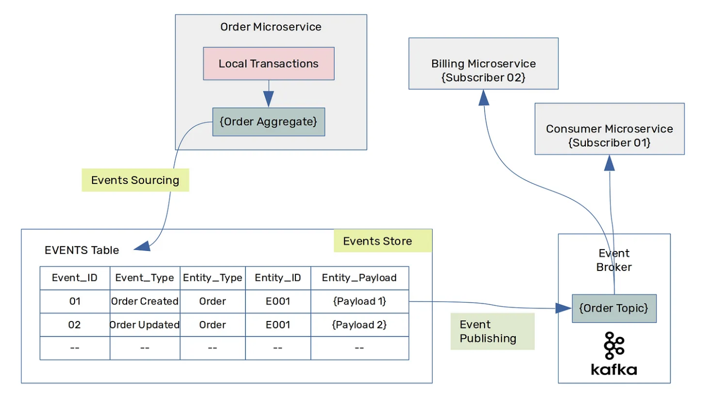

## State-oriented persistence

Since the 1980s, relational databases started to dominate the world of data persistence. However, with the rise of OOP, developers started to struggle to persist objects in relational databases. Such a struggle was known as **"object-relational impedance mismatch"**. Alternative families of databases appeared over the decades to address the mismatch issues, but all that is stored in the database is the **current state** of the system.

Users perform actions called **commands** that trigger updates to data objects, which are then persisted in a database. All DBMSes support four basic operations for persistence: CRUD. System objects usually are persisted as database records i.e. rows in tables or documents. When an object changes, and the change needs to be persisted, the database record gets replaced by a new record.

## Historical record

Often keeping only the current state of an entity is not enough. When such a requirement is present, developers often choose to save a particular update history in a separate table or in transaction log files.

However, these transactional logs may not give you the complete picture of a transaction state. There are times when we don't just want to see where we are, we also want to know how we got there.

Moreover, there is no guarantee that the business won't require keeping the record on other state changes. Hence, all the history before the change that would keep such a record will be lost.

Change history of entities can allow access to previous states, but ignores the meaning of those changes, so that any manipulation of the information is procedural, and often pushed out of the domain layer.

## Event Sourcing

Event Sourcing is an alternative way to persist **aggregates**. In contrast with state-oriented persistance, Event Sourcing stores each state mutation as a separate record called an **event** in an append-only log.

Event Sourcing ensures that all changes to application state are stored as a sequence of events. An entity’s current state can be created by **replaying** all the events in order of occurrence i.e. chronologically ordered list of events. As the context is stored within the events, the ‘why’ and ‘when’ of the event are implicitly stored within the data for the event.

This can simplify tasks in complex domains, by avoiding the need to synchronize the data model and the business domain, while improving performance, scalability, and responsiveness. It can also provide consistency for transactional data, and maintain full audit trails and history that can enable compensating actions.

This strategy **should not be exposed beyond the boundaries of aggregates**. The events from event sourcing should therefore only be used **internally** in the corresponding aggregate or in the context of CQRS to build related read models.



### Benefits

- Can reliably publish events whenever the state of an aggregate changes
- The stored events not only describe the current state, but also how this state has been reached
- Inherent atomic operation
- It is possible at any time to reconstruct any state from the past by replaying the events only up to a certain point in time
- It is conceivable to use event sourcing to handle incorrect processing of previous events or the arrival of a delayed event
- It can provide an audit log that is guaranteed to be accurate

### Drawbacks

- The implementation of event sourcing also entails a certain conceptual and technical complexity
- Events are not supposed to change once persisted, whereas the domain logic often evolves over time
- If an aggregate schema changes over time, you will probably need to have another event store version to store the new changes in the schema
- Querying an event store could be challenging (CQRS)

## Events

An event represents a fact that took place in the domain i.e. source of truth. They are the source of truth; your current state is derived from the events. They are **immutable** (can only be created or read), and represent the business facts.

When a command from a user is received, the event-sourced system will translate it into an event. The event can be used to update any state held in memory, but only the event is stored in the database i.e. WithdrawMoney translated into MoneyWithdrawn.

An event usually contains unique metadata such as the timestamp of the event, the unique identifier of the subject, etc. The data within the event will be used in the write model to populate the state and make decisions, as well as populate read models.

### Explicit mutations as domain events

A domain event is a fully-fledged part of the domain model, a representation of something that happened in the domain.

When we model state changes as domain events, we can make those changes explicit and use the domain language (Ubiquitous Language) to describe the change i.e. order payment received, discount applied, line item removed, etc.

## Event Store

Event aggregates are stored as a sequence of events in a state-transition database known as an Event Store i.e. EventStoreDB, RavenDB, MartenDB. The events are **immutable**; it is a well-known rule of Event Stores.

When you use a relational or document database, you retrieve a single record with the entity id, representing the current entity state. In contrast, when you retrieve an entity from an event database, you get multiple records, and each record is an event.

When we read all events from a single entity stream, we can reconstruct the current state by calling When() for all the events, in sequence.

### Entities as event streams

Within the event store, the events referring to a particular domain or domain object are stored in a **stream**. A stream should have a unique identifier representing the specific object. Event streams are the source of truth for the domain object and contain the full history of the changes. You can retrieve state by reading all the stream events and applying them one by one in the order of appearance.

Event stores are built to be able to store a huge number of events efficiently. You don’t need to be afraid of creating lots of streams, however, you should watch the number of events in those streams. Streams can be short-lived with lots of events, or long-lived with fewer events. Shorter-lived streams are helpful for maintenance and makes versioning easier.

### Optimizing

In systems with larger volumes of data, you can use RDBMS functionality for implementing Query (CQRS) by storing the current view of the event-sourced data i.e. **projections**.

Alternatively, you can persist the projections or snapshots in-memory, if the number of events is small.

## Projections (View Models/Query Models)

Projections provide a view of the underlying event-based data model. Often they represent the logic of translating the source write model into the read model. They are used in both read models and write models.

### Read model

The read model can be, but doesn’t have to be, derived from the write model. It’s a transformation of the results of the business operation into a readable form.

### Stream aggregation

Stream aggregation is a process of building the current state of the write model from the stream events. The main purpose of a stream aggregation is to **rebuild the current state to validate an executed command against it**.

Projections should be treated as temporary and disposable i.e. they rae an **interpretation of the raw data from events**. This is one of their key benefits as they can be destroyed, re-imagined and recreated at will; they should not be considered the source of truth.

### Read vs projection models

There is a lot of conceptual crossover between a projection and a read model. The simplest way to understand the relationship between projections and read models is that a read model is made of multiple projections. The projections are the method of populating your read model, and represent discrete parts of the whole read model.

## Event publishing and subscribing

One of the most significant advantages of Event Sourcing is observability. Event stores enable that through the subscriptions functionality. You can subscribe to either all events (directly from the append-only log) or partitioned/filtered events data (e.g. events from the specific stream, stream type, event type, etc.).

However, it is important to take note that although event stores can provide publish/subscribe functionality, they’re usually optimized for storage, not transport. For higher throughput needs or cross-service communication, it’s worth considering using additional specialized streaming solutions, such as Kafka or Kinesis.

## Command handling flow

```c#
// Event properties are primitive types or shared complex types.
// These attributes MUST be serializable.
public abstract class Entity {
    List<object> changes;

    public void Apply(object event) {
        When(event);
        changes.Add(event);
    }

    // Each event will mutate the state in-process.
    // This is required for consequent events
    // i.e. ItemAdded and TotalUpdated
    protected abstract void When(object event);
}


public class ItemAdded {
    public string OrderId;
    public Shared.OrderItem Item;
    public double Total;
}

public class Order extends Entity {
    OrderId id;
    OrderItem[] items;
    Money totalAmount;

    public AddItem(OrderItem newItem) {
        if (!CanAddItem(item))
            throw new DomainException("Unable to add the item");

        // Not Event Sourcing if direct mutation of
        // entity state is performed.
        // items.Add(newItem);
        // totalAmount = totalAmount.Add(newItem.LineTotal);

        // An event is produced instead.
        var newTotal = totalAmount.Add(newItem.LineTotal).AsDouble;
        Apply(
            new ItemAdded {
                OrderId = id,
                Item = Map(newItem),
                Total = newTotal
            }
        );
    }

    // For the code that mutates the entity state based on events,
    // it should not have any advanced logic or calculations.
    protected void When(object event) {
        switch (event) {
            case ItemAdded e:
                items.Add(OrderItem.FromEvent(e.Item));
                totalAmount = e.Total;
                break;
            case ItemRemoved e:
                break;
        }
    }
}
```

```c#
public class EntityStore {
    EventDatabase db;
    Serializer serializer;

    public void Save<T>(T entity) where T : Entity {
        var changes = entity.changes;
        if (changes.IsEmpty()) return; // nothing to do

        var dbEvents = new List<DbEvent>();
        foreach (var event in changes) {
            var serializedEvent = serializer.Serialize(event);
            dbEvents.Add(
                data: new DbEvent(serializedEvent),
                type: entity.GetTypeName();
            );
        }
        var streamName = EntityStreamName.For(entity);
        db.AppendEvents(streamName, dbEvents);
    }

    public T Load<T>(string id) where T : Entity {
        var streamName = EntityStreamName.For(entity);
        var dbEvents = db.ReadEvents(streamName);
        if (dbEvents.IsEmpty()) return default(T); // no events

        var entity = new T();
        foreach (var event in dbEvents) {
            entity.When(event);
        }
        return entity;
    }
}
```
