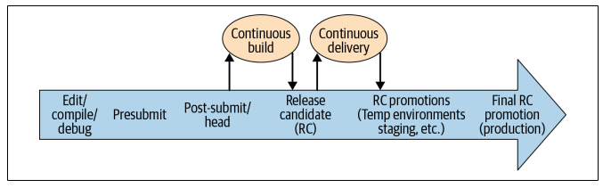

## Continuous Testing

### Presubmit is not enough

Although the main objective to catch problematic changes ASAP, the main reason why not all tests are run on presubmit is because it is too expensive.

Engineer productivity is extremely valuable, and waiting a long time to run every test during code submission can be severely disruptive. Similarly, it is expensive for engineers to be blocked on presubmit by failures arising from instability or flakiness that has nothing to do with their code change. Also, during the time we run presubmit tests to confirm that a change is safe, the underlying repository might have changed in a manner that is incompatible with the changes being tested (mid-air collision).

### Presubmit vs post-submit

General rule of thumb is only fast, reliable tests should be run on presubmit. You can accept some loss of coverage, but that means you need to catch any issues that slip by on post-submit. On post-submit, you can accept longer times and some instability, as long as you have the proper mechanisms to deal with it.

### Release candidate testing

As Continuous Delivery builds RCs, it will run larger tests against the entire candidate. We test an RC by promoting it through a series of test environments and testing it at each deployment. This can include a combination of sandboxed, temporary environments and shared test environments i.e. dev, staging. It is common to include some manual QA testing of the RC in shared environments.

Several reasons why it is important to run a comprehensive, automated test suite against an RC, even if it is the same suite that Continuous Build just ran against the code on post-submit:

- Sanity check
- For auditability (do not need to dig through CB logs to find an RC's test results)
- For emergency pushes

### Production testing

We should run the same suite of tests against production that we did agains the RC earlier on to verify:

- The working state of production according to our tests
- The relevance of our tests, according to production
