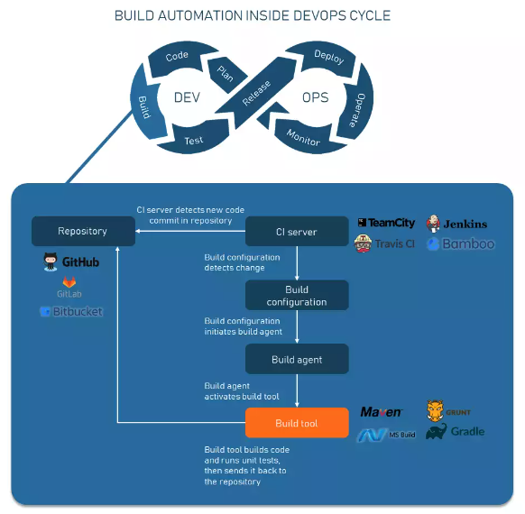

## CI/CD Pipeline

Continuous Integration is the process where software is built and testing stages are completed.

Continuous Delivery is an extension of CI which automatically deploys all code changes to a testing or production environment after build stage.

Continuous Deployment goes one step further than CD. With this practice, every change that passes all stages of your production pipeline is released to customers and there's no human intervention.

CI/CD pipelines are a practice focused on improving software delivery using either a DevOps or Site Reliability Engineering (SRE) approach. A series of steps that must be performed in order to deliver a new version of software. Introduces monitoring and automation to improve the process of application development. Pipeline elements include:

1. Build: Stage where application is compiled.
2. Test: Stage where code is tested.
3. Release: Stage where application is delivered to repository.
4. Deploy: Stage where code is deployed to production.
5. Validation and Compliance: Determined by needs of organization.

### Benefits

Good CI/CD pipeline is fast, reliable and accurate:

- Developers can stay focused on writing code and monitoring the behavior of the system in production
- QA and product stakeholders have easy access to the latest, or any, version of the system
- Product updates are not stressful
- Logs of all code changes, tests and deployments are available for inspection at any time
- Rolling back to a previous version in the event of a problem is a routine push-button action
- A fast feedback loop helps build an organizational culture of learning and responsibility

### CI Servers

Jenkins, TeamCity, Travis CI, Bamboo and CircleCI.

## Build Automation

Build automation is an approach to handling builds within a CI/CD pipeline that has several steps:

#### 1. Developer commits source code to a repository

Developer commits to a VCS (version control system).

#### 2. CI server detects the change

CI server is a system that orchestrates a CI pipeline, allowing teams to commit code multiple times per day, and build automatically outside of the developer's IDE (on a dedicated cloud or VM). A CI server regularly polls a repository to check for new commits and save changes in a separate database.

#### 3. Build configuration recognizes changes and triggers a build agent

A build configuration is a set of rules determining how the build is supposed to happen. You can also define which operations and tools you need to complete the build, adjust steps, or configure VCS settings.

#### 4. Build agent activates build tools

A build agent is a program deployed on a build server that takes orders from the CI server and starts a build. The agent doesn't compile code, but listens to what a server with its configuration has to say and orders build tools to do their job in the way a developer configured.

#### 5. Build tools compile, compress, run unit tests, etc.

Build tools do the low-level work. A build tool is a script, framework or software created specifically for a given programming language to compile code, run tests, or do other operations needed for a build.

#### 6. Build artifacts are sent back to the server

If the code passes all build stages including testing, it is normally sent back to the CI server, at which point it can go to production, further testing, or storage.

### Build Cycle

