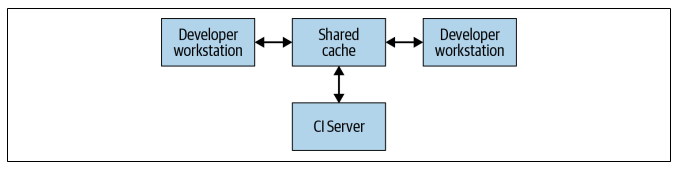
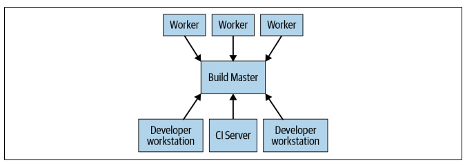

## Distributed Builds

For large codebases, the only way to complete a build in a reasonable amount of time is to distribute the work across an arbitrary and scalable number of machines.

## Remote Caching

The simplest type of distributed build is one that only leverages on remote caching. Every system that performs builds (developer, CI systems) shares a reference to a common remote cache service.

This service might be a fast and local short-term storage like Redis or GCP. Whenever a user needs to build an artifact, whether directly or as a dependency, the system first checks with the remote cache to see if the artifact already exists. If not, the system builds and uploads the result back to the cache.

For remote caching system to work, the build system must guarantee that builds are completely reproducible. This is the only way to ensure that the results of downloading an artifact are the same as the results of building it oneself. Bazel provides this guarantee and hence, supports remote caching.

For there to be any benefit, downloading an artifact must be faster than building it. This might not be the case if the cache server is far from the machine performing the build.

## Remote Execution

The build tool running on each user's machine sends request to a central build master. The build master breaks the requests into their component actions and schedules the execution of those actions over a scalable pool of workers. Each worker performs the actions asked of it with the inputs specified by the user and writes out the resulting artifacts. These artifacts are shared across the other machines executing actions that require them.

The trickiest part of implementing such a system is managing the communication between the workers, the master, and the user's local machine. To do this, we can **build on top of the distributed cache by having each worker write its results to and read its dependencies from the cache**. The master blocks workers from proceeding until everything they depend on has finished.

For this to work, build environments must be completely self-describing so that workers can be spun up without human intervention. Build processes must be containerized, and outputs must be deterministic.

### ObjFS

Google's remote cache is called ObjFS. It consists of a backend that stores build outputs in Bigtables distributed throughout the fleet of production machines and a frontend FUSE daemon (objfsd) that runs on each developer's machine. The FUSE daemon allows engineers to browse build outputs, but with the content downloaded on-demand.

### Forge

Google's remote execution is called Forge. A Forge client in Blaze (Distributor) sends requests for each action to a job running in datacenters called the Scheduler. The Scheduler maintains a cache of action results, allowing it to return a response immediately if the action has already been created by any other user of the system. If not, it places the action into a queue. A large pool of Executor jobs continually read actions from this queue, execute them, and store the results directly in the ObjFS Bigtables. These results are available to the executors for future actions, or to be downloaded by the end user via objfsd.

## Managing Dependencies

Modules need to be able to refer to one another.

### Internal

In a large project broken down into fine-grained modules, most dependencies are likely to be internal i.e. on another target defined and built in the same source repository. This differs from external dependencies, which need to be downloaded as a prebuilt artifact.

### Transitive

One issue that needs to be handled carefully is transitive dependencies i.e. A depends on B, which depends on C. There is no problem with A referencing classes from C; however, when B does not depend on C after refactoring, any target that uses classees from C through B would break.

This issue can be solved by introducing a "strict transitive dependency mode", which is done in Blaze. Blaze detects whether a target tries to reference a symbol without depending on it directly, and if so, fails with an error and a shell command that can automatically insert the dependency.

### External

External dependencies are imported directly from an artifact repository and used as-is rather than being built from source.

#### Manual vs automatic dependency management

Build systems should use **manual dependency management for versioning** rather than automatic, as it can be a recipe for disaster on projects of nontrivial size, or that are being worked on by more than one engineer. Even if the build doesn't break, there can be subtle behavior or performance changes that are impossible to track down.

#### One-version rule

When a project's targets depend on the same dependencies, each target can choose which version it wanted to use. However, this can cause alot of problems in practice, and is best to enforce a **strict one-version rule** for all third party dependencies.

#### Transitive external dependencies

For transitive external dependencies, different libraries can depend on different versions of the same third-party library, and this would violate the one-version rule. Unfortunately, there is no silver bullet. An alternative is to require a global file that list every single one of the repository's external dependencies, and an explicit version used for that dependency throughout the repository.

#### Security

Depending on artifacts from third-party sources is inherently risky. There is an availability risk if the third-party source goes down, and a security risk if the system is compromised by an attacker.

Both problems can be mitigated by mirroring any artifacts you depend on onto servers you control and blocking your build system from accessing third-party artifact repositories like Maven Central.
