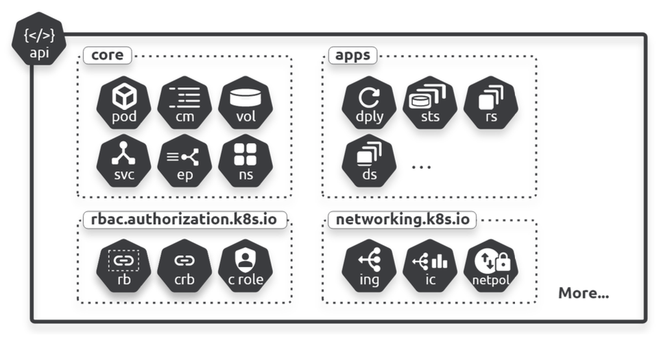

## API

The API is where all Kubernetes resources are defined. Resources and objects are used interchangeably, as most API resources happen to be objects i.e. Pods, Services, Ingresses, etc.

Resources can either be namespaced or cluster-scoped. Namespaced objects have to be deployed to a particular Namespace, while cluster-scoped objects can either be bound to multiple Namespaces, or exist outside of Namespaces.

At the highest level, there are two types of API group: core and named groups.



```bash
$ kubectl api-resources # see resources and api groups
$ kubectl api-versions # shows which versions are supported by cluster
$ for kind in `kubectl api-resources | tail +2 | awk '{ print $1 }'`; \
do kubectl explain $kind; done | grep -e "KIND:" -e "VERSION:"
```

### API Core groups (legacy)

Resources in the core group are mature objects that were created in the early days of Kubernetes before the API was divided into groups i.e. Pods, nodes, Services, Secrets, ServiceAccounts. They are located in /api/v1. New resources are added to a named group, and not to the core group.

```
/api/v1

Pods        /api/v1/namespaces/<namespace>/pods/
Services    /api/v1/namespaces/<namespace>/services/
Nodes       /api/v1/nodes/
Namespaces  /api/v1/namespaces/
```

### API Named groups

All new resources go into named groups, and each refers to a collection of related resources. Dividing the API into smaller groups makes it more scalable and easier to navigate.

```
/apis/$GROUP_NAME/$VERSION

Ingress         /apis/networking.k8s.io/v1/namespaces/{namespace}/ingresses/
RoleBinding     /apis/rbac.authorization.k8s.io/v1/namespaces/{namespace}/rolebindings/
ClusterRole     /apis/rbac.authorization.k8s.io/v1/clusterroles/
StorageClass    /apis/storage.k8s.io/v1/storageclasses/
```

### Modifying API server

kube-apiserver runs as a static pod on master node and static pod definition files are available at a path defined by parameter called **staticPodPath**.

The API server configurations are stored under `/etc/kubernetes/manifests/kube-apiserver.yaml`. This file is monitored by the Kubelet service, which runs the kube-apiserver process in a container. If the Kubelet detects a chance in that file, it restarts the container with the updated configuration.

It is recommended to make a copy before performing any changes.

```bash
$ cp /etc/kubernetes/manifests/kube-apiserver.yaml . # not in same directory as manifests
$ vim /etc/kubernetes/manifests/kube-apiserver.yaml

# validating changes
$ watch crictl ps
$ ps aux | grep kube-apiserver | grep privileged

# restarting
$ systemctl restart kubelet.service
```

### Enabling/disabling API groups

You can enable or disable them by setting --runtime-config on the API server. The flag accepts comma separated key=value pairs. If value part is omitted, it is treated as true.

```conf
--runtime-config=batch/v1=false,batch/v2alpha1
```

### Versioning

New resources come in as alpha, progress through beta, and eventually reach stable status.

Resources in alpha are experimental and should expect bugs, features to be dropped without warning, and changes as they graduate through beta to stable. Use it with extreme caution.

You can use `kubectl convert` to convert config files between different API versions.

https://kubernetes.io/docs/tasks/tools/install-kubectl-linux/#install-kubectl-convert-plugin

```bash
$ kubectl convert -f <old-file> --output-version <new-api>
$ kubectl convert -f pod.yaml # convert to latest version
$ k convert -f ingress-old.yaml --output-version networking.k8s.io/v1
```

### Accessing the API

You can explore the API more directly using the following options:

- API development tools
- Commands like curl, wget
- Web browser

The simplest way to do this is to run a kubectl proxy on your localhost adapter that handles all security and authentication.

```bash
$ kubectl proxy --port 9000
```

### Deprecation policy rules

1. API elements may only be removed by incrementing the version of the API group
2. API objects must be able to round-trip between API versions in a given release without information loss, with the exception of whole REST resources that do not exist in some versions
3. An API version in a given track may not be deprecated until a new API version at least as stable is released (GA can deprecate alpha and beta versions, but not the other way around)
4. Other than the most recent API versions in each track, older API versions must be supported after their announced deprecation for a duration of no less than:

- GA: 12 months or 3 releases (whichever is longer)
- Beta: 9 months or 3 releases (whichever is longer)
- Alpha: 0 releases

### Process flow

1. Subject (user, Pods, kubelets, services, etc.) makes a request to the API server secured with TLS
2. Authentication module authenticates subject
3. Authorization module (RBAC) authorizes subject to perform requests
4. Policies are enforced with admission controls
5. Request is accepted and executed (persisted to the cluster store)

### JSON serialization

Kubernetes serializes objects as JSON to be sent over HTTP, but also supports Protobuf as a serialization schema.

### Resources

All deployable objects (Pods, Services, Ingresses, etc.) are defined as resources in the API. If the object is not defined in the API, you cannot deploy it.

API resources have properties that you can view and configure.

## API Server

The main job of the API server is to make API available to clients inside and outside the cluster. It exposes the API over a secure RESTful interface using HTTPS exposed on port 443 or 6443:

- All kubectl commands go to the API server
- All node kubelets watch the API server for new tasks and report status
- All control plane services communicate via the API server (components don't talk directly to each other)

The API server is a Kubernetes control plane service and runs as a set of Pods in the kube-system Namespace on the control plane nodes of your cluster. If you build and manage your own Kubernetes clusters, you need to make sure the **control plane is highly-available and has enough performance** to keep the API server up and running. If you are using a hosted cluster, the way the API server is implemented is hidden from you.

```bash
$ kubectl cluster-info
$ kubectl proxy --port 9000 # exposes the API on localhost adapter
```

```
GET /api/v1/namespaces/shield/pods
$ kubectl get pods --namespace shield
```

## Custom API

You can extend Kubernetes by adding your own resources and controllers. Kubernetes has a CustomResourceDefintion (CRD) object that lets you create new resources in the API. They also get their REST paths in the API.
