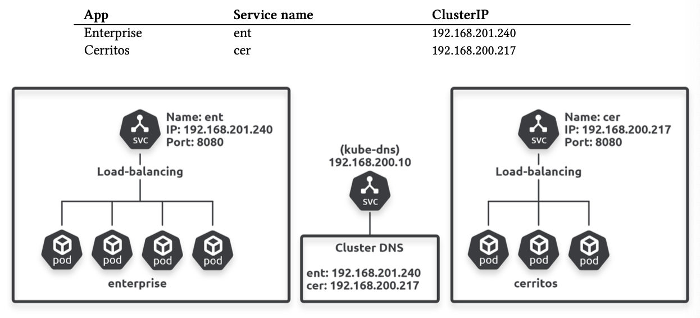
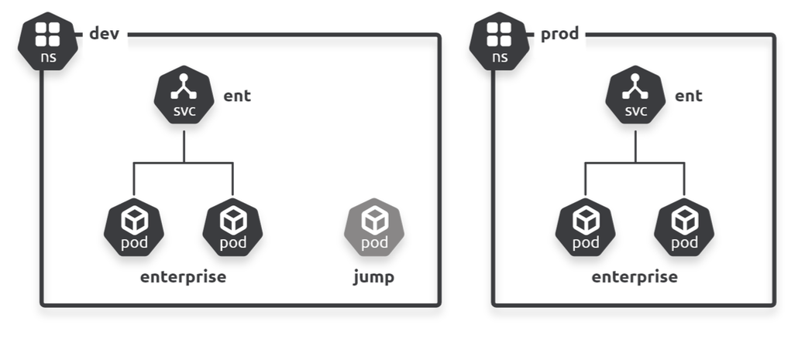

## Service discovery

Two important things to note about service discovery:

1. Kubernetes uses its internal DNS as a service registry (discovery)
2. All Kubernetes Services automatically register their details with DNS (registration)

## Registration

The kubelet agent on every node is watching the API server for new Endpoints objects. When it sees one, it creates local networking rules to redirect ClusterIP traffic to Pod IPs. The technology used to create rules is the **Linux IP Virtual Server (IPVS)**; older versions used iptables.

### Process

1. You post a new Service manifest to the API server
2. The request is authenticated, authorized, and subjected to admission policies
3. The Service is allocated a stable virtual IP address (ClusterIP)
4. Config is persisted to cluster store
5. An Endpoints object is created to hold a list of healthy Pods matching the Service's label selectors
6. Cluster DNS watches the API server for new Service objects
7. The Service's name and IP are registered with the cluster DNS
8. kube-proxy on every node observes the new Endpoint object and creates local IPVS rules to handle traffic sent to the ClusterIP

## Discovery

Kubernetes provides a well-known internal DNS service called 'cluster DNS'. Every Pod in the cluster knows where to find it. The important components are:

- Cluster DNS is implemented in the **kube-system** Namespace as a set of one or more Pods managed by a Deployment called **coredns**
- Pods are fronted by a Service called **kube-dns** that listens on port 53 TCP/UDP
- Behind the scenes, it is based on a DNS technology called CoreDNS and runs as a Kubernetes-native application
- Endpoints object is also called kube-dns
- All objects are tagged with k8s-app=kube-dns label

```sh
$ kubectl get pods -n kube-system -l k8s-app=kube-dns # lists the Pods running clusterDNS
$ kubectl get deploy -n kube-system -l k8s-kube-dns # lists deployment
$ kubectl get svc -n kube-system -l k8s-app=kube-dns
$ kubectl get endpoint <name>
```

### Example



### ClusterIPs

ClusterIPs are on a special network called the **service network** which has no routes to it. This means containers send all ClusterIP traffic to their default gateway.

A default gateway is where devices send traffic when there is no known route. Normally, the default gateway forwards traffic to another device with a larger routing table in the hope it will have a route to the destination. However, it is also possible that it never finds a route and the traffic times out.

### DNS resolution

Kubernetes automatically configures every container so it can find and **use the cluster DNS to convert Service names to ClusterIPs**. It does this by populating `/etc/resolv.conf` file with the IP address of cluster DNS Service, as well as any search domains that should be appended to unqualified names.

```sh
$ cat /etc/resolv.conf
# search svc.cluster.local cluster.local default.svc.cluster.local
# nameserver 192.168.200.10
# options ndots:5
```

1. Container sends Service name to cluster DNS to resolve to an IP address (ClusterIP)
2. Container sends traffic to the clusterIP network
3. Traffic is routed to container's default gateway (ClusterIPs are virtual IPs that are on the special service network with no route to it)
4. Traffic is forwarded to the node the container is running on
5. Traffic is routed to the node's default gateway (node doesn't have a route)
6. Request is processed by the node's kernel
7. Trap is triggered via IPVS rule
8. Request is redirected to the IP address of a Pod that matches the Services label selector

### Namespaces

Every cluster has an address space, and that Namespaces partition it. Cluster address spaces are based on a DNS domain called the **cluster domain**. Object names have to be unique within a Namespace but not across Namespaces.

If a Pod wants to access a Service in its local namespace, you can use its short name i.e. ent. However, for Pods to reach a Service in another namespace, you need to use the **FQDN** i.e. ent.dev.svc.cluster.local.

```
// fully qualified domain name (FQDN)

<object-name>.<namespace>.svc.cluster.local
ent.default.svc.cluster.local
ent.dev.svc.cluster.local
ent.prod.svc.cluster.local
```

## Example



```yaml
apiVersion: v1
kind: Namespace
metadata:
  name: dev
```

```yaml
apiVersion: v1
kind: Namespace
metadata:
  name: prod
```

```yaml
apiVersion: apps/v1
kind: Deployment
metadata:
  name: enterprise
  labels:
    app: enterprise
  namespace: dev
spec:
  selector:
    matchLabels:
      app: enterprise
  replicas: 2
  template:
    metadata:
      labels:
        app: enterprise
    spec:
      containers:
        - image: nigelpoulton/k8sbook:text-dev
      name: enterprise-ctr
      ports:
        - containerPort: 8080
```

```yaml
apiVersion: apps/v1
kind: Deployment
metadata:
  name: enterprise
  labels:
    app: enterprise
  namespace: prod
spec:
  selector:
    matchLabels:
      app: enterprise
  replicas: 2
  template:
    metadata:
      labels:
        app: enterprise
    spec:
      containers:
        - image: nigelpoulton/k8sbook:text-dev
        name: enterprise-ctr
      ports:
        - containerPort: 8080
```

```yaml
apiVersion: v1
kind: Service
metadata:
  name: ent
  namespace: dev
spec:
  selector:
    app: enterprise
  ports:
    - port: 8080
  type: ClusterIP
```

```yaml
apiVersion: v1
kind: Service
metadata:
  name: ent
  namespace: prod
spec:
  selector:
    app: enterprise
  ports:
    - port: 8080
  type: ClusterIP
```

```yaml
apiVersion: v1
kind: Pod
metadata:
    name: jump
    namespace: dev
spec:
    terminationGracePeriodSeconds: 5
    containers:
        - name: jump
        image: ubuntu
        tty: true
        stdin: true
```

## Troubleshooting service discovery

Service registration and discovery involves a lot of moving parts. If any of them stops working, the whole process can break.

### coredns

Check that the Pods deployed by coredns are up and running.

```sh
$ kubectl get deploy -n kube-system -l k8s-app=kube-dns
$ kubectl get pods -n kube-system -l k8s-app=kube-dns
$ kubectl logs coredns-5644d7b6d9-74pv7 -n kube-system
```

### Restarting Pods

Deleting Pods will be restarted as they are managed by a Deployment object.

```sh
$ kubectl delete pod -n kube-system -l k8s-app=kube-dns
```

### Interactive shell inside Pod

Start a troubleshooting Pod that have networking tools installed.

```sh
$ kubectl run -it dnsutils \
--image gcr.io/kubernetes-e2e-test-images/dnsutils:1.3
```

Use nslookup to resolve kubernetes Service fronting the API server.

```sh
$ nslookup kubernetes
```
