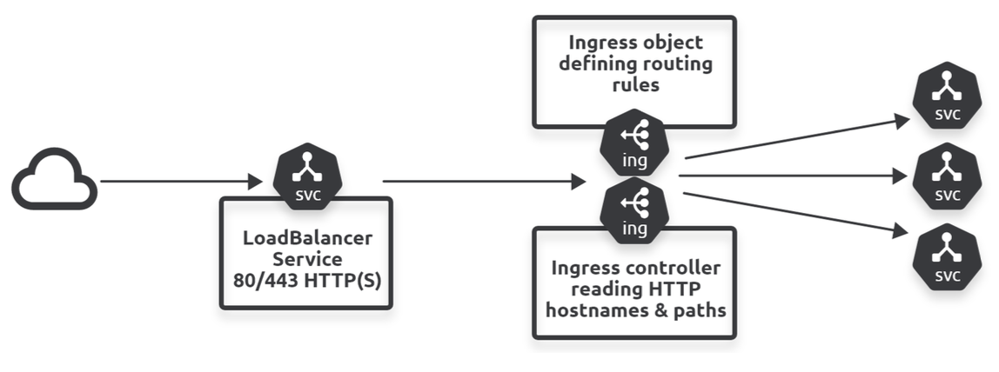

## Ingress

Ingresses are closely related objects and are used to set up HTTP routes to Services via a load balancer i.e. operates at Layer 7 of OSI model, **layer 7 load balancer**. Also support HTTPS traffic secured by TLS certificates.

For LoadBalancer Services, a cluster with 25 internet-facing apps will need 25 cloud load balancers (1-to-1 mapping). Ingress fixes this by providing access to **multiple web applications through a single LoadBalancer Service**.

Ingress objects are the rules that govern how traffic reaching the load-balancer is routed to backend services. The Ingress controller uses hostnames and paths to make intelligent routing decisions.

Ingress and service mesh have overlapping functionalities i.e. if you plan to run a service mesh, you may not need Ingress.



## Components

The **object spec** defines rules that govern traffic routing, and the **controller** implements the rules.

An **Ingress resource** is a set of rules and configurations applied on the Ingress controller. For routes that do not match any rules, the requests are directed to a Service called **default-http-backend**. Hence, it is important to define such a Service.

Alternatively, you can specify **defaultBackend** which is an ObjectRef to another Kubernetes resource within the same namespace as the Ingress object. A Resource is a mutually exclusive setting with Service, and will fail validation if both are specified. A common usage for a Resource backend is to ingress data to an object storage backend with static assets.

However, a lot of Kubernetes clusters don't ship with a built-in Ingress controller i.e. you have to install one. Once you have an Ingress controller, you deploy Ingress objects with rules that govern how traffic hitting the Ingress is routed. Ingress controllers have additional intelligence built into them to monitor the Kubernetes cluster for new definitions or Ingress resources, and configure the server accordingly. Examples of Ingress controllers include GCP HTTP and Nginx.

For controller configurations, you can deploy a ConfigMap. You also need a Service to expose the Ingress controller to the external world.

### Resource

**Ingress and its corresponding service need to be in same namespace**; otherwise ingress cannot discover endpoints from the service.

If the ingressClassName is omitted, the default should be defined through an IngressClass resource.

```yaml
apiVersion: networking.k8s.io/v1
kind: Ingress
metadata:
  name: ingress-wildcard-host
  namespace: hello-world
  annotations:
    nginx.ingress.kubernetes.io/rewrite-target: /
spec:
  ingressClassName: nginx-example
  rules:
    - host: "foo.bar.com"
      http:
        paths:
          - pathType: Prefix
            path: "/bar"
            backend:
              service:
                name: service1
                port:
                  number: 80 # port of service
    - host: "*.foo.com"
      http:
        paths:
          - pathType: Prefix
            path: "/foo"
            backend:
              service:
                name: service2
                port:
                  number: 80

---
apiVersion: v1
kind: Service
metadata:
  name: service1
  namespace: hello-world
spec:
  ports:
    - port: 80
      protocol: TCP
      targetPort: 8080
  selector:
    app: webapp-pay
  sessionAffinity: None
  type: ClusterIP
```

### Ingress class

Ingresses can be implemented by **different controllers, often with different configuration**. Each Ingress should specify a class, a reference to an IngressClass resource that contains additional configuration including the name of the controller that should implement the class.

An Ingress resource can target a specific ingress controller instance, which is useful when running multiple ingress controllers in the same cluster. To target a specific ingress controller, you must first install that ingress controller with a unique class name.

```yaml
apiVersion: networking.k8s.io/v1
kind: IngressClass
metadata:
  name: external-lb
  annotations:
    ingressclass.kubernetes.io/is-default-class: "true" # sets the default ingress class if not specified
spec:
  controller: example.com/ingress-controller
  parameters:
    # config related to ingress controller
    apiGroup: k8s.example.com
    kind: IngressParameters
    name: external-lb
```

### Ingress Controller and Service

```yaml
apiVersion: apps/v1
kind: Deployment
metadata:
  labels:
    app.kubernetes.io/component: controller
    app.kubernetes.io/instance: ingress-nginx
    app.kubernetes.io/managed-by: Helm
    app.kubernetes.io/name: ingress-nginx
    app.kubernetes.io/part-of: ingress-nginx
    app.kubernetes.io/version: 1.1.2
    helm.sh/chart: ingress-nginx-4.0.18
  name: ingress-nginx-controller
  namespace: ingress-nginx
spec:
  minReadySeconds: 0
  revisionHistoryLimit: 10
  replicas: 1
  selector:
    matchLabels:
      app.kubernetes.io/component: controller
      app.kubernetes.io/instance: ingress-nginx
      app.kubernetes.io/name: ingress-nginx
  template:
    metadata:
      labels:
        app.kubernetes.io/component: controller
        app.kubernetes.io/instance: ingress-nginx
        app.kubernetes.io/name: ingress-nginx
    spec:
      containers:
        - args:
            - /nginx-ingress-controller
            - --publish-service=$(POD_NAMESPACE)/ingress-nginx-controller
            - --election-id=ingress-controller-leader
            - --watch-ingress-without-class=true
            - --default-backend-service=app-space/default-http-backend
            - --controller-class=k8s.io/ingress-nginx
              - --ingress-class=nginx
            - --configmap=$(POD_NAMESPACE)/ingress-nginx-controller
            - --validating-webhook=:8443
            - --validating-webhook-certificate=/usr/local/certificates/cert
            - --validating-webhook-key=/usr/local/certificates/key
          env:
            - name: POD_NAME
              valueFrom:
                fieldRef:
                  fieldPath: metadata.name
            - name: POD_NAMESPACE
              valueFrom:
                fieldRef:
                  fieldPath: metadata.namespace
            - name: LD_PRELOAD
              value: /usr/local/lib/libmimalloc.so
          image: registry.k8s.io/ingress-nginx/controller:v1.1.2@sha256:28b11ce69e57843de44e3db6413e98d09de0f6688e33d4bd384002a44f78405c
          imagePullPolicy: IfNotPresent
          lifecycle:
            preStop:
              exec:
                command:
                  - /wait-shutdown
          livenessProbe:
            failureThreshold: 5
            httpGet:
              path: /healthz
              port: 10254
              scheme: HTTP
            initialDelaySeconds: 10
            periodSeconds: 10
            successThreshold: 1
            timeoutSeconds: 1
          name: controller
          ports:
            - name: http
              containerPort: 80
              protocol: TCP
            - containerPort: 443
              name: https
              protocol: TCP
            - containerPort: 8443
              name: webhook
              protocol: TCP
          readinessProbe:
            failureThreshold: 3
            httpGet:
              path: /healthz
              port: 10254
              scheme: HTTP
            initialDelaySeconds: 10
            periodSeconds: 10
            successThreshold: 1
            timeoutSeconds: 1
          resources:
            requests:
              cpu: 100m
              memory: 90Mi
          securityContext:
            allowPrivilegeEscalation: true
            capabilities:
              add:
                - NET_BIND_SERVICE
              drop:
                - ALL
            runAsUser: 101
          volumeMounts:
            - mountPath: /usr/local/certificates/
              name: webhook-cert
              readOnly: true
      dnsPolicy: ClusterFirst
      nodeSelector:
        kubernetes.io/os: linux
      serviceAccountName: ingress-nginx
      terminationGracePeriodSeconds: 300
      volumes:
        - name: webhook-cert
          secret:
            secretName: ingress-nginx-admission

---
apiVersion: v1
kind: Service
metadata:
  creationTimestamp: null
  labels:
    app.kubernetes.io/component: controller
    app.kubernetes.io/instance: ingress-nginx
    app.kubernetes.io/managed-by: Helm
    app.kubernetes.io/name: ingress-nginx
    app.kubernetes.io/part-of: ingress-nginx
    app.kubernetes.io/version: 1.1.2
    helm.sh/chart: ingress-nginx-4.0.18
  name: ingress-nginx-controller
  namespace: ingress-nginx
spec:
  ports:
    - port: 80
      protocol: TCP
      targetPort: 80
      nodePort: 30080
  selector:
    app.kubernetes.io/component: controller
    app.kubernetes.io/instance: ingress-nginx
    app.kubernetes.io/name: ingress-nginx
  type: NodePort
```

## TLS

TLS is handled by the Ingress controller, not the Ingress resource i.e. the Ingress controller accesses it and makes it part of its configuration.

Adding TLS to Ingress requires you to:

- Create a Kubernetes secret with certificate (server.crt) and private key file (server.key)
- Add TLS block to the Ingress resource with the exact hostname used to generate the TLS certificate

```sh
kubectl create secret tls hello-app-tls \
  --namespace dev \
  --key server.key \
  --cert server.crt
```

```yaml
apiVersion: networking.k8s.io/v1
kind: Ingress
metadata:
  name: hello-app-ingress
  namespace: dev
spec:
  ingressClassName: nginx
  tls:
    - hosts:
        - demo.mlopshub.com
      secretName: hello-app-tls
  rules:
    - host: "demo.mlopshub.com"
      http:
        paths:
          - pathType: Prefix
            path: "/"
            backend:
              service:
                name: hello-service
                port:
                  number: 80
```
