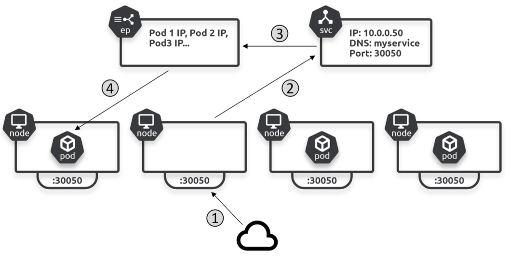

## NodePort

Built on top of the ClusterIP type and enables external access via a dedicated port (NodePort) on every cluster node using NAT. Fowards requests to the NodePort on every cluster node back to the Service.

NodePorts are between 30,000 and 32,767. If not specified, Kubernetes will pick a random port.

```yaml
apiVersion: v1
kind: Service
metadata:
  name: magic-sandbox
spec:
  type: NodePort
  ports:
    - port: 8080 # Pods can access the Service via 8080
      nodePort: 30050 # clients access cluster via 30050
      targetPort: 8080 # Traffic forwarded to Pods on 8080
      protocol: TCP
  selector:
    app: hello-world
```

### Process flow



1. An external client hits node2 on port 30050
2. Client is redirected to the Service object
3. Service object directs client to a healthy Pod on node1 via Endpoints slices
