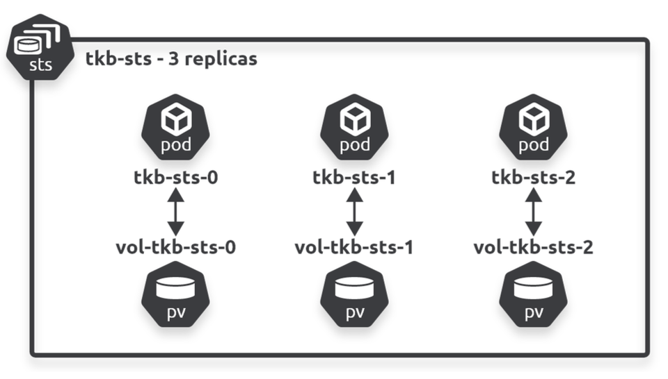

## StatefulSets

StatefulSets are first-class API objects that follow the typical Kubernetes controller architecture. It is implemented as controller that operates reconciliation loops watching the state of the cluster, via the API server, and moving the **observed state** into sync with **desired state**. Supports self-healing, scaling, updates, etc.

### Comparing with Deployments

Compared to Deployments, StatefulSets guarantee:

- Predictable and persistent Pod names
- Predictable and persistent DNS hostnames
- Predictable and persistent volume bindings

These three properties form the state of the Pod, often referred to as its 'sticky ID'. StatefulSets ensure this sticky ID is persistent across failures, scaling, and other scheduling operations, making them **ideal for applications that require unique Pods that are not interchangeable**.

### Pod naming

All Pods managed by a StatefulSet get predictable and persistent names. The format is `<StatefulSetName>-<Integer>` (zero-based index). StatefulSet names need to be a valid DNS name.

### Ordered creation and deletion

Another fundamental characteristic of StatefulSets is the controlled and ordered way they start and stop Pods i.e. Pods are created in a sequential order.

StatefulSets create one Pod at a time, and always wait for previous Pods to be **ready and running** before creating the next. This is different from Deployments that use a ReplicaSet controller to **start all Pods at the same time**, causing potential race conditions. When scaling up or down, the same principle applies.

Knowing the order in which Pods will be scaled down, and that Pods will not be termianted in parallel, is a game-changer for many stateful apps. Clustered apps that store data can potentially lose data if multiple replicas go down at the same time. StatefulSets guarantee this will never happen.

Nonetheless, it is possible to tweak the controller and ordered starting and stopping of Pods via the StatefulSet's **spec.podManagementPolicy** property. The default setting is OrderedReady and implements a strict methodical ordering.

### Deleting StatefulSets

Deleting a StatefulSet **does not terminate Pods in order**. Hence, you might want to scale down to 0 replicas before deleting it. You can also use terminationGracePeriodSeconds to further control the way Pods are terminated.

### Volumes and volumeClaimTemplates

Volumes are an important part of StatefulSet Pod's sticky ID.

When a StatefulSet is created, any volumes it needs are created at the same time and named in a special way that connects them to the right Pod with naming of `vol-<StatefulSetName>-<Integer>`.

Volumes are appropriately decoupled from Pods via the PVC system i.e. volumes have separate lifecycles to Pods. If a StatefulSet Pod is terminated, the replacement Pod will be attached to the **same storage it is replacing**. This statement holds true even if the replacement Pods are scheduled to different cluster nodes.

For scaling operations, if a Pod is deleted as part of a scale-down operation, subsequent scale-up operations will attach new Pods to the surviving volumes that match their names. Hence, future scale-up operations only need to create a new Pod.

Every StatefulSet that uses volumes **need to be able to create them dynamically** i.e. using a SC and PVC. However, each Pod needs its own unique storage, and is not possible with PVC as each Pod is created from the same template. This is where **volumeClaimTemplates** come into play.

A volumeClaimTemplate dynmically creates a PVC each time the StatefulSet controller spawns a new Pod replica. It also contains intelligence to name the PVC so it conencts to the right Pod. The format of the PVC name is `<volumeClaimTemplateName>-<StatefulSetName>-<Integer>`.



### Handling failures

The StatefulSet controller observes the state of the cluster and attempts to keep observed state in sync with deisred state. However, if a failed Pod recovers after Kubernetes has replaced it, you will have two identical Pods trying to write to the same volume which can result in **data corruption**.

Possible node failures are very difficult to deal with. If Kubernetes has lost contact with a node, it will not know whether it was due to a temporary glitch, network failure, or crashed kubelet. Moreover, the controller cannot force the Pod to terminate in the event the local kubelet does not receive the instruction. Hence, manual intervention is needed before Kubernetes will replace Pods on failed nodes.

### Networking and Headless Services

Sometimes you don't need load-balancing and a single Service IP. As Pods have predictable names, other parts of the app may connect directly to the Pods. To make this possible, StatefulSets use a **headless service** to create predictable DNS hostnames for every Pod replica. Other apps can then query DNS for the full list of Pod replicas and use those details to connect directly to Pods.

A headless service is a regular Kubernetes Service object without an IP address i.e. **spec.clusterIP is set to None**. It becomes a StatefulSet's governing Service when you list it in the manifest under spec.serviceName.

When the two objects are combined, the service with create DNS Service (SRV) records for each Pod replica that matches the label selector of the headless Service. Other Pods and apps can then find members of the StatefulSet by performing DNS lookups against the name of the headless Service, instead of using the Service's ClusterIP.

By default, Kubernetes places all objects within the cluster.local DNS subdomain, and Kubernetes contructs DNS subdomains with the naming `<object-name>.<service-name>.<namespace>.svc.cluster.local`.

The spec.serviceName fields designates the **governing service** as it is in charge of the DNS subdomain used by the StatefulSet.

```yaml
apiVersion: v1
kind: Service
metadata:
  name: mongo-prod
spec:
  clusterIP: None # headless service
  selector:
    app: mongo
    env: prod
---
apiVersion: apps/v1
kind: StatefulSet
metadata:
  name: sts-mongo
spec:
  # automatically assigns the hostname and subdomain for each Pod
  # based on the headless service
  serviceName: mongo-prod # governing service
---
apiVersion: v1
kind: Pod
metadata:
  name: myapp-pod
  labels:
    app: mongo
    env: prod
spec:
  containers:
    - name: mongodb
      image: mongodb
  # for Deployment, to create DNS record for Pod, need specify subdomain and hotname
  # for StatefulSets, both are not required fields
  # mongodb-pod.mongo-pod.default.service.cluster.local
  subdomain: mongo-prod # name of headless service
  hostname: mongodb-pod
```

## Example

```yaml
apiVersion: v1
kind: Service
metadata:
  name: nginx
  labels:
    app: nginx
spec:
  ports:
    - port: 80
      name: web
  clusterIP: None
  selector:
    app: nginx
---
apiVersion: apps/v1
kind: StatefulSet
metadata:
  name: web
spec:
  selector:
    matchLabels:
      app: nginx # has to match .spec.template.metadata.labels
  serviceName: "nginx"
  replicas: 3 # by default is 1
  minReadySeconds: 10 # by default is 0
  template:
    metadata:
      labels:
        app: nginx # has to match .spec.selector.matchLabels
    spec:
      terminationGracePeriodSeconds: 10
      containers:
        - name: nginx
          image: registry.k8s.io/nginx-slim:0.8
          ports:
            - containerPort: 80
              name: web
          volumeMounts:
            - name: www
              mountPath: /usr/share/nginx/html
  volumeClaimTemplates:
    - metadata:
        name: www
      spec:
        accessModes: ["ReadWriteOnce"]
        storageClassName: "my-storage-class"
        resources:
          requests:
            storage: 1Gi
```
